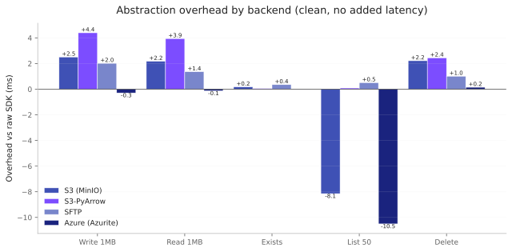
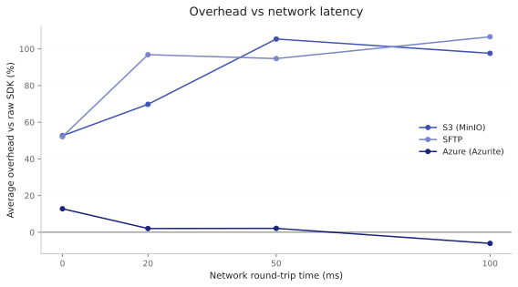
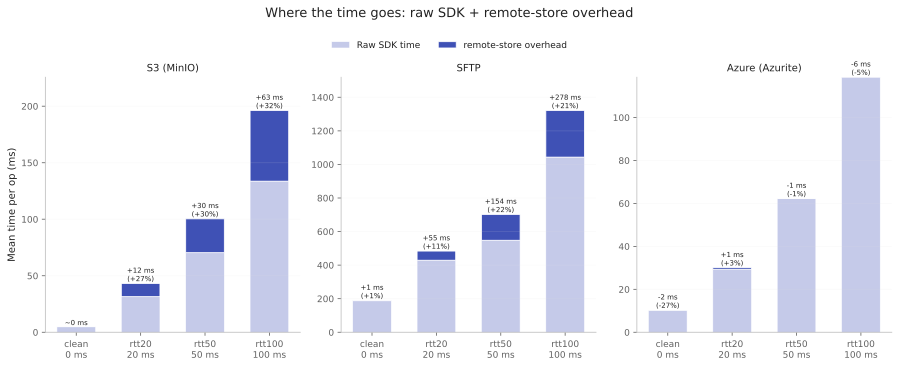
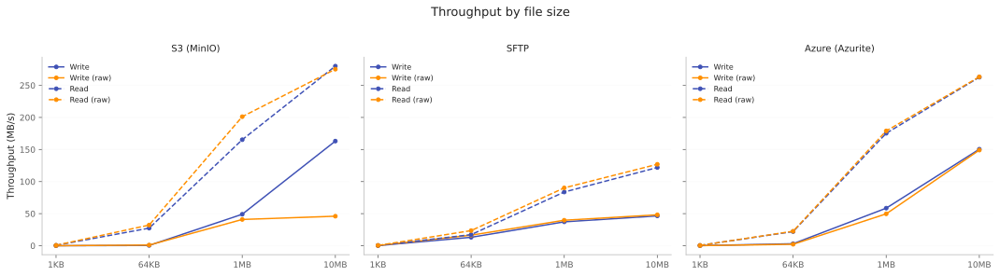
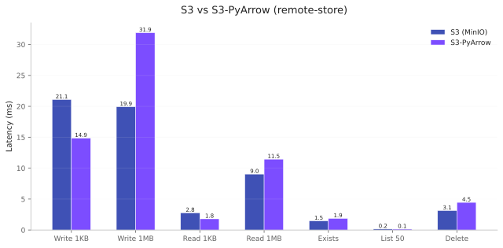

# Performance

remote-store wraps established Python storage libraries. This page presents
the **measured** overhead of that wrapper and the levers to test it against
your own workload. It does not tell you whether the overhead is acceptable —
that depends on your call volume, latency budget, and alternatives, so it is
your call, not the library's.

remote-store's overhead comes from the work the wrapper does around each call:
chiefly a small, fixed number of **extra protocol round trips per operation**
(for example an extra `stat` to resolve a path before a write), plus a
sub-millisecond CPU cost. That has a consequence the numbers below make concrete.
Where the wrapper adds round trips, its cost **scales with network round-trip
time**, because the cost of a round trip *is* the round-trip time. So the
absolute overhead **grows** with latency rather than staying a fixed millisecond
or two; its *share* of the total call can rise or fall depending on how
round-trip-bound the raw operation already is (see
[What Happens Under Real Latency](#what-happens-under-real-latency)). Backends
that add no extra round trips stay near zero at every latency. The numbers below
report that cost in milliseconds; whether it is worth paying is your call. To
measure it for your own hardware and latency, use the levers in
[Running Benchmarks](#running-benchmarks) — the `hatch run bench-*` commands and
the four `--network-profile` profiles.

## Overhead at a Glance

The chart below shows remote-store's overhead in **milliseconds** versus raw
SDK calls for each backend, measured on the clean profile (no added latency).
Negative values mean remote-store is *faster* than calling the SDK directly
(often due to connection pooling and caching).



Patterns from Docker benchmarks (MinIO, Azurite, OpenSSH):

- **S3**: reads and writes add a few milliseconds over raw boto3; listing is
  faster in absolute terms via s3fs connection caching. Those few milliseconds
  are extra protocol round trips, so the overhead grows with network round-trip
  time (quantified in the next section).
- **S3-PyArrow**: reads carry more overhead than the S3 backend (PyArrow C++
  data path); writes are comparable. The trade-off is native PyArrow integration
  — Tier 1 C++ range requests — not raw throughput.
- **Azure** and **SFTP**: per-operation overhead is near zero — a millisecond or
  two either way on a clean link — except Azure listing, which the chart shows
  running faster than the raw SDK (the same listing win S3 shows). Because neither
  backend adds extra protocol round trips per operation, their real overhead stays
  near zero under latency too.
- **Local**: all operations are sub-millisecond; overhead versus raw pathlib is
  a sub-millisecond cost per call. Whether that registers depends on your
  call volume and how much of your latency budget is local I/O.

Regenerate numbers for your own hardware with `hatch run bench-report`
(see [Running Benchmarks](#running-benchmarks)).

## What Happens Under Real Latency

Under realistic network round-trip times (20–100 ms), the absolute overhead
**grows** wherever remote-store's extra work is itself a count of round trips.
The chart below tracks the average overhead in milliseconds as simulated RTT
rises: for S3 it climbs steadily, since each extra round trip costs one more RTT.
SFTP and Azure add no extra round trips per operation, so their real overhead
stays near zero — the SFTP line dips noticeably below zero at mid-range RTT only
because its multi-second emulator write dominates the five-op average, a
measurement artifact rather than overhead (see the caveat below).



The single largest case is an S3 write or delete, which carries about one extra
protocol round trip of overhead — so on the order of one RTT (~+100 ms on a
100 ms link). The decomposition below splits each operation's mean time into the
raw SDK cost and the remote-store overhead stacked on top, labelled in
milliseconds and as a share of the total, so the raw op time and the
latency-scaled overhead are both visible:



One caveat for the SFTP panel: both the raw bar and the overhead segment are plain
means across operations, so both are dominated by the 1MB write — an
unrepresentative emulator artifact (see [SFTP write throughput](#caveats) below).
That write's measurement noise alone can swing the labelled SFTP overhead a fair
way below zero at mid-range RTT, so read it as near zero within noise (the backend
adds no extra round trips), not as a real speedup, and ignore the raw bar's growth.

The overhead's *share* of the total moves independently of its absolute size: for
S3 it grows into a visible slice of the average operation under latency, while for
SFTP and Azure it stays near zero. The share is not the
cost — the milliseconds are.

The benchmark suite simulates latency using [Toxiproxy](https://github.com/Shopify/toxiproxy)
with four named profiles:

| Profile | Latency | Jitter | Simulates |
|---------|---------|--------|-----------|
| `clean` | 0 ms | 0 ms | Baseline (passthrough) |
| `rtt20` | 20 ms | 7 ms | Same-region cloud |
| `rtt50` | 50 ms | 17 ms | Cross-region |
| `rtt100` | 100 ms | 33 ms | Cross-continent |

## Throughput by File Size

How throughput scales with file size, comparing remote-store to raw SDK:



At larger file sizes, throughput converges as the per-operation overhead
is amortized across more bytes.

## S3 vs S3-PyArrow

Both S3 backends connect to the same service. S3 uses s3fs (Python), S3-PyArrow
uses PyArrow's C++ `S3FileSystem` for data-path operations. The chart below
compares their absolute latencies:



S3-PyArrow reads are slower for sequential workloads because the C++ data path
adds connection management and metadata overhead per call. The S3-PyArrow
backend's advantage is native [PyArrow integration](../guides/pyarrow-adapter.md) — Tier 1
Parquet column pruning, I/O coalescing, and GIL-free reads. For sequential
byte streaming, the regular S3 backend is faster.

## Practical Takeaways

These follow from the numbers above. Whether the overhead is acceptable for
*your* workload is still your call — measure it (see
[Running Benchmarks](#running-benchmarks)).

- **Overhead is per operation, not per byte.** It shows up across many small
  calls (exists, metadata, small reads/writes, listings) and fades on larger
  transfers, where it is spread across more bytes.
- **As round-trip time grows, so does the absolute overhead.** remote-store's
  extra work is a count of protocol round trips, so its millisecond cost scales
  with RTT rather than shrinking to a vanishing fraction — an S3 write or delete
  carries about one extra round trip of overhead (~+90 to +110 ms at 100 ms RTT).
  Its *share* of the total call can rise or fall, but the absolute cost grows;
  measure it for your own latency.
- **Workload shape drives the impact.** The same per-operation cost is a large
  share of a sub-millisecond local `exists` and a small share of a 100 MB
  transfer, so call-heavy patterns feel it more than bulk I/O.
- **Throughput converges with file size.** Larger files approach raw-SDK
  throughput as the per-operation cost is amortized across more bytes.
- **Measure, then reduce call count where it matters.** Benchmark your own
  workload with `hatch run bench-*` and the `--network-profile` profiles; batch
  or cache calls if the per-operation cost dominates your access pattern.

## Comparative Results

For every operation, the benchmark suite runs the same workload through three
interfaces:

1. **remote-store** — the `Backend` / `Store` API
2. **Raw SDK** — direct boto3/paramiko/azure-storage-blob/pathlib calls
3. **fsspec** — s3fs/sshfs/adlfs/fsspec.local

### Sample Results

Results vary by hardware, network, and service version. Generate numbers for
your environment with `hatch run bench-report` (summary) or
`hatch run bench-report-user` (condensed, with magnitude bands). Those bands are
*shares* of the raw-SDK time — a quick relative read; the absolute millisecond
delta, which is what scales with RTT, is in `bench-report` and the charts above.

For a full per-backend comparison of remote-store against the raw SDK and
fsspec, see the Detailed Comparative Tables section on the
[Performance page](https://docs.remotestore.dev/stable/explanation/performance/).

## Caveats

- **Docker emulators are not cloud.** Azurite, MinIO, and the local SFTP
  container approximate real services but have different performance
  characteristics. Treat these numbers as relative comparisons, not
  absolute predictions of cloud performance.
- **Listing anomalies.** Some fsspec implementations (s3fs, adlfs) show
  sub-100us listing times that reflect client-side caching, not real
  storage-layer performance. `S3Backend` defaults this directory-listing
  cache off (fresh listings every call), so those sub-100us numbers appear
  only when the cache is explicitly re-enabled via
  `client_options={"use_listings_cache": True}`; with the default, the s3fs
  path issues a fresh listing like raw boto3.
- **Delete overhead is an S3 pattern, not universal.** The S3 backends check
  that the object exists before removing it, an extra round trip, so their delete
  runs about double raw boto3 on a clean link and scales with RTT like other
  round-trip overhead. SFTP and Azure delete within a percent of their raw SDKs —
  they add no extra round trip.
- **SFTP write throughput is an emulator artifact.** On the Docker OpenSSH
  container, a 1MB SFTP write takes close to a second — far slower than the same
  write via `sshfs` or against a real server — because the paramiko transport
  issues many small, unpipelined SFTP write packets over the local container.
  remote-store and raw paramiko land within a percent of each other on that row,
  because the write path adds no metadata round trips of its own, so the
  *overhead* the chart reports is right; the absolute SFTP write throughput is
  not representative of a tuned or cloud SFTP endpoint.
  Measure your own server with `hatch run bench-cloud`.
- **Streaming reads keep memory constant** regardless of file size.

## Methodology

Benchmarks use [pytest-benchmark](https://pytest-benchmark.readthedocs.io/)
with Docker-hosted services (MinIO for S3, Azurite for Azure, OpenSSH for
SFTP). Each test runs in an isolated environment — fresh buckets, containers,
and directories are created per test fixture and cleaned up after.

| Metric | How | Where |
|--------|-----|-------|
| **Throughput** (MB/s) | payload_bytes / mean_time | Write, read, roundtrip |
| **TTFB** (ms) | Time to write/read 1KB file | Protocol overhead |
| **Latency** (ms) | Mean operation time | Exists, delete, list |
| **Memory** (MB) | tracemalloc peak | Large-file read/write |
| **Listing speed** | Time to list N files | 50, 200, 1k, 10k files |

## Running Benchmarks

```bash
# Start Docker services
docker compose -f infra/docker-compose.yml up -d --wait

# Quick tier (~2 min/backend)
hatch run bench

# Standard tier (~5 min/backend)
hatch run bench-standard

# Full tier (~20-30 min/backend)
hatch run bench-full

# With simulated latency (single profile)
hatch run bench -- --backend s3-latency,sftp-latency,azure-latency --network-profile rtt50

# Latency matrix (runs rtt20, rtt50, rtt100 sequentially, ~8 min/profile)
hatch run bench-latency-matrix

# Save results as JSON
hatch run bench-save

# Reports
hatch run bench-report                    # summary table
hatch run bench-report-user               # condensed, with magnitude bands
hatch run bench-report-comparative        # remote-store vs raw SDK vs fsspec
hatch run bench-charts                    # generate SVG charts

# Stop services
docker compose -f infra/docker-compose.yml down -v
```

For cloud benchmarks, set the appropriate environment variables (see
`benchmarks/README.md` for the full reference table) and use `--infra cloud`.

## Detailed Comparative Tables

Per-backend tables comparing remote-store, raw SDK, and fsspec for each
operation. Generated with `hatch run bench-report-comparative-md`.

--8<-- "benchmarks/results/comparative.md"

## See also

- [Capabilities Matrix](../reference/capabilities-matrix.md) — feature support per backend
- [Choosing a Backend](../guides/choosing-a-backend.md) — decision guide with trade-offs
- [PyArrow Adapter](../guides/pyarrow-adapter.md) — tiered read strategy and S3 direct I/O
