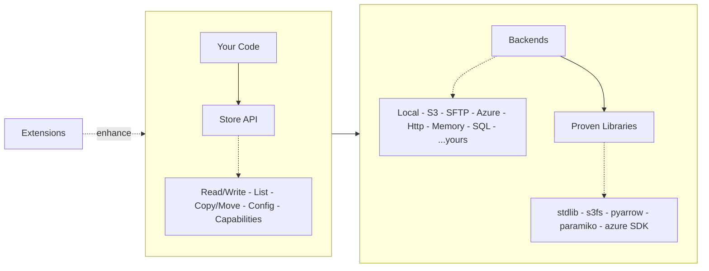

---
hide:
  - navigation
---

# remote-store

A Store is a logical folder.
Where files live is configuration.

remote-store provides a single interface for file storage across local
filesystems, S3, SFTP, Azure, and more — using the libraries you would choose
yourself.

---

## Architecture



- The **Store** provides a portable API
- **Backends** implement storage-specific behavior
- **Libraries** do the actual I/O
- **Extensions** add optional capabilities alongside the core

---

## The core idea

A `Store` scopes all operations to a root path. Everything is relative.

```python
--8<-- "examples/snippets/homepage.py:core-idea"
```

Switch backend without changing application code:

<!-- Inline block: S3Backend can't be instantiated without credentials,
     so this is not sourced from a snippet file. See ID-057 notes. -->
```python
from remote_store import Store
from remote_store.backends import S3Backend

store = Store(S3Backend(bucket="my-bucket"))
store.write_text("file.txt", "hello")
print(store.read_text("file.txt"))  # same API, different backend
```

Narrow scope with `child()` — all paths inside are relative to the new root:

```python
--8<-- "examples/snippets/homepage.py:child-scoping"
```

See [Store child scoping](examples/store-child.md) for more.

---

## Design principles

### Zero dependencies in core

Install only what you use. `pip install remote-store` pulls in nothing.
Extras like `[s3]` or `[sftp]` bring in only the backend you need.

### Proven libraries underneath

`s3fs`, `paramiko`, Azure SDK — remote-store adapts, they execute.
Backends delegate to the packages you'd pick yourself.

### Backend-native when possible

`glob()` and atomic writes work everywhere. Where the backend supports them
natively, remote-store uses that. Where not, a portable fallback steps in.

```python
--8<-- "examples/snippets/homepage.py:capabilities"
```

### Extensions sit beside, not around

Caching, observability, batch operations, PyArrow — import what you need
from `remote_store.ext`. Your Store code doesn't change.

---

## Bring your own

Implement the `Backend` protocol for a new storage target. Or write an
extension. The hooks are public.

```python
--8<-- "examples/snippets/homepage.py:custom-backend"

store = Store(MyBackend(...))  # works with all extensions
```

---

## Quick start

```bash
pip install remote-store[s3]
```

```python
from remote_store import Store
from remote_store.backends import S3Backend

store = Store(S3Backend(bucket="my-bucket"))
store.write_text("file.txt", "hello")
print(store.read_text("file.txt"))  # 'hello'
```

See [Getting Started](getting-started.md) for a complete walkthrough.

---

## Start here

- New to remote-store → [Tutorial](getting-started.md)
- Minimal working example → [Quickstart](examples/quickstart.md)

## Common tasks

- Read and write files → [File Operations](examples/file-operations.md)
- Stream large files → [Streaming I/O](examples/streaming-io.md)
- Work with S3 → [S3 Backend](examples/s3-backend.md)
- Handle errors → [Error Handling](examples/error-handling.md)
- Use caching → [Caching](examples/caching.md)

## Go deeper

- All guides → [Backends](backends/index.md) · [Extensions](extensions.md)
- API reference → [Store API](api/store.md)
- Capabilities → [Capabilities matrix](capabilities-matrix.md)
- Architecture and design → [Architecture](architecture.md)
- Further readings → [Further Reading](further-reading.md)
