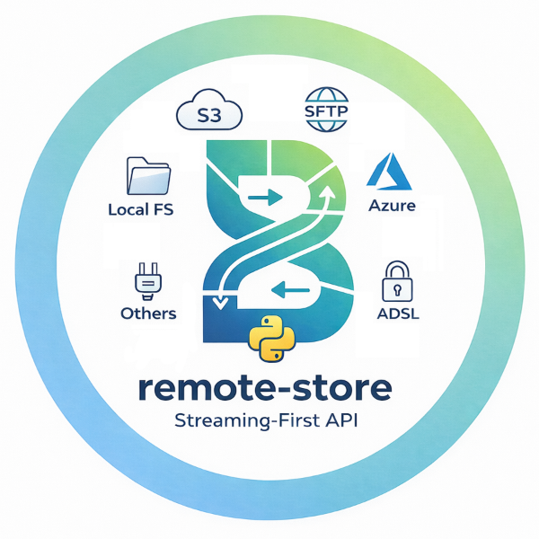

---
hide:
  - navigation
---

<p align="center">
  
</p>

<h2 align="center">Backend-agnostic remote storage for Python</h2>

<p align="center"><em>One API for local files, S3, Azure Blob, SFTP, and more.</em></p>

---

Every project that touches files eventually writes the same glue code: read bytes from S3 here, swap in a local directory for tests there, add error handling around each call, remember to close streams. `remote-store` extracts that pattern into a single, narrow API so your application code never knows -- or cares -- where files actually live.

## Features

- **Backend-agnostic** file operations through a single `Store` API
- **Streaming-first** I/O for memory-efficient large file handling
- **Atomic writes** with capability-driven backend support
- **Config-as-code** with `RegistryConfig` and `from_dict()` for easy setup
- **Type-safe** with full mypy strict mode compliance
- **Zero framework dependencies** -- works with any sync codebase

## Quick Start

```python
import tempfile
from remote_store import BackendConfig, RegistryConfig, Registry, StoreProfile

with tempfile.TemporaryDirectory() as tmp:
    config = RegistryConfig(
        backends={"local": BackendConfig(type="local", options={"root": tmp})},
        stores={"data": StoreProfile(backend="local", root_path="data")},
    )

    with Registry(config) as registry:
        store = registry.get_store("data")

        store.write("hello.txt", b"Hello, world!")
        content = store.read_bytes("hello.txt")
        print(content)  # b'Hello, world!'
```

## Next Steps

- [Getting Started](getting-started.md) -- install, configure, and run your first operations
- [Examples](examples/index.md) -- runnable scripts covering every feature
- [API Reference](api/index.md) -- complete reference for all public classes
- [Backends](backends/index.md) -- supported storage backends
