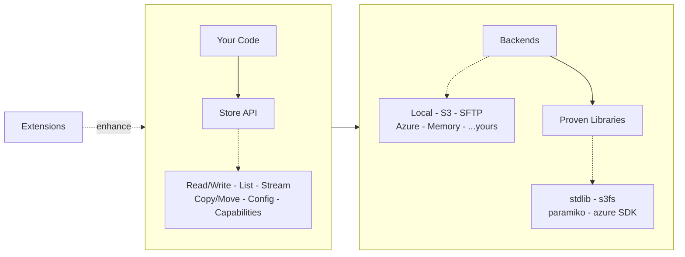

# Plan: ID-090 — Docs Landing Page

**Date:** 2026-03-16
**Status:** Idea — draft for discussion

---

## Problem

The current docs homepage (`docs-src/index.md`) is a 1:1 include of `README.md`.
A GitHub README answers "should I try this?" for someone scanning repos. A docs
landing page speaks to someone who already clicked through — it should answer
"how does this thing work and where do I start?"

They share content, but serve different purposes.

---

## Core Messages

Six messages, ordered by priority. Each becomes a short section on the page.

### 1. A Store is a logical folder

Scoped to a root path. Everything inside is relative.
`store.child("sub")` narrows scope further.

### 2. Zero dependencies in core

`pip install remote-store` pulls in nothing. Extras like `[s3]` or `[sftp]`
bring in only the backend you need.

### 3. Proven libraries do the heavy lifting

Backends delegate to `s3fs`, `paramiko`, `azure SDK` — the packages you'd pick
yourself. remote-store adapts; they execute.

### 4. Portable API, backend-native when possible

`glob()` and atomic writes work everywhere. Where the backend supports them
natively, remote-store uses that. Where not, a portable fallback steps in.
`store.supports(Capability.GLOB)` tells you which.

### 5. Extensions sit beside, not around

Caching, observability, batch ops, PyArrow — import what you need.
Your Store code doesn't change.

### 6. Bring your own

Implement the `Backend` protocol for a new storage target. Or write an
extension. The hooks are public.

---

## Architecture Diagram (Mermaid)

The diagram communicates concepts and relationships, not inventory.

**Horizontal spine:** Extensions → Store → Backends → Proven Libraries.
**Vertical detail:** Your Code above Store; method kinds below Store;
backend names below Backends; library names below Libraries.



### Diagram design decisions

- **Conceptual, not exhaustive.** No individual method names, no full backend
  list. `...yours` hints at extensibility without a dedicated box.
- **Three relationships.** Extensions enhance Store (dashed = optional).
  Store delegates to Backends (solid). Backends delegate to Libraries (solid).
- **Mixed direction via subgraphs.** LR spine for the concept flow, TB within
  subgraphs for detail layers. Subgraph links (not inner-node links) preserve
  direction.

---

## Page Structure (Sketch)

```
Hero line:
  "A Store is a logical folder. Where files live is configuration."

Architecture diagram (mermaid)

Section: A Store is a logical folder
Section: Zero dependencies in core
Section: Proven libraries do the heavy lifting
Section: Portable API, backend-native when possible
Section: Extensions sit beside, not around
Section: Bring your own

Quick start snippet (from existing README, trimmed)

Links: Getting Started · Backends · Extensions · API Reference
```

---

## What this is NOT

- Not a rewrite of the README. The README stays as-is for GitHub.
- Not a tutorial. The getting-started guide already exists.
- Not an architecture deep-dive. The architecture page already exists.

The landing page is a **concise orientation** — here's the mental model, here's
the shape, here's where to go next.

---

## Open Questions

1. Should the hero include a tiny code snippet (3 lines) or just the tagline?
2. Should "Who this is for" from the README appear on the landing page too?
3. How much of the comparison table (if any) belongs on the landing page vs.
   a dedicated page?

---

## Implementation Steps

1. Create `docs-src/index.md` with the content above (replacing the README
   include).
2. Verify mermaid renders correctly with `hatch run docs`.
3. Ensure the README remains unchanged — GitHub and docs diverge from here.
4. Review: does the page feel like an orientation, not a pitch?
