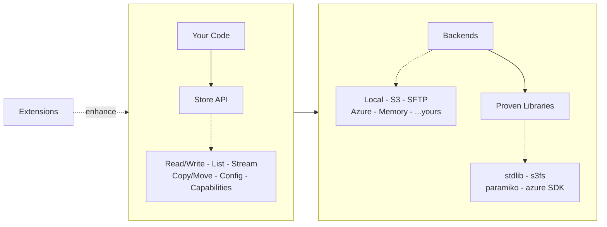

# Research: ID-090 — Docs Landing Page

**Date:** 2026-03-16
**Updated:** 2026-03-18
**Status:** Done — page shipped with placeholder flowchart. Diagram rework deferred.

---

## Problem

The current docs homepage (`docs-src/index.md`) is a 1:1 include of `README.md`.
A GitHub README answers "should I try this?" for someone scanning repos. A docs
landing page speaks to someone who already clicked through — it should answer
"how does this thing work and where do I start?"

They share content, but serve different purposes.

---

## Core Messages

Six messages, ordered by priority. Each becomes a short section on the page.

### 1. A Store is a logical folder

Scoped to a root path. Everything inside is relative.
`store.child("sub")` narrows scope further.

### 2. Zero dependencies in core

`pip install remote-store` pulls in nothing. Extras like `[s3]` or `[sftp]`
bring in only the backend you need.

### 3. Proven libraries do the heavy lifting

Backends delegate to `s3fs`, `paramiko`, `azure SDK` — the packages you'd pick
yourself. remote-store adapts; they execute.

### 4. Portable API, backend-native when possible

`glob()` and atomic writes work everywhere. Where the backend supports them
natively, remote-store uses that. Where not, a portable fallback steps in.
`store.supports(Capability.GLOB)` tells you which.

### 5. Extensions sit beside, not around

Caching, observability, batch ops, PyArrow — import what you need.
Your Store code doesn't change.

### 6. Bring your own

Implement the `Backend` protocol for a new storage target. Or write an
extension. The hooks are public.

---

## Architecture Diagram (Mermaid)

The diagram communicates concepts and relationships, not inventory.

**Horizontal spine:** Extensions → Store → Backends → Proven Libraries.
**Vertical detail:** Your Code above Store; method kinds below Store;
backend names below Backends; library names below Libraries.



### Diagram design decisions

- **Conceptual, not exhaustive.** No individual method names, no full backend
  list. `...yours` hints at extensibility without a dedicated box.
- **Three relationships.** Extensions enhance Store (dashed = optional).
  Store delegates to Backends (solid). Backends delegate to Libraries (solid).
- **Mixed direction via subgraphs.** LR spine for the concept flow, TB within
  subgraphs for detail layers. Subgraph links (not inner-node links) preserve
  direction.

> **[~] OPEN — diagram needs rework.** See §Diagram Rework below.
> The current flowchart is a placeholder; the final diagram should read as
> architecture, not flow control.

---

## Diagram Rework

The current `flowchart LR` reads as a process flow — boxes and arrows that imply
data moving left-to-right. The goal is an **architectural overview**: layers,
groups, and relationships that communicate structure, not execution order.

### Options considered

| Option | Pros | Cons |
|--------|------|------|
| **Mermaid `architecture-beta`** | Native to docs; no extra toolchain; purpose-built for architecture; looks like component/service diagrams | Beta status; syntax is simpler/less expressive than C4 |
| **Mermaid C4** | Formal C4 model notation; very readable at context/container level | Verbose; best for system-context diagrams, not internal layer maps |
| **D2** | Best-looking output of any text-defined diagram tool; very expressive layout engine | Extra toolchain (separate binary or CI step); not native to MkDocs/Mermaid |

### Decision

**Primary choice: Mermaid `architecture-beta`**

Reasons:
- Stays native to the docs build — no extra toolchain beyond Mermaid support already in MkDocs Material.
- Syntax is designed for component/service/layer diagrams, not flowcharts.
- Easy to maintain alongside the plan.
- Looks significantly more architectural than `flowchart`.

**Aspirational option: D2**

If the Mermaid `architecture-beta` output is still not expressive enough, D2
produces the best-looking text-defined architecture diagrams available. The
trade-off is a separate build step. Worth revisiting if the docs build gains a
pre-processing stage.

### What the reworked diagram must preserve

- Horizontal conceptual spine: Extensions → Store → Backends → Libraries
- Detail layers beneath each group (method kinds, backend names, library names)
- Three relationship types: Extensions *enhance* Store (optional/dashed),
  Store *delegates to* Backends, Backends *use* Libraries
- `...yours` hint for extensibility without a dedicated node

### Mermaid `architecture-beta` sketch

```
architecture-beta
  group core(server)[Core]
  group infra(server)[Infrastructure]

  service ext(cloud)[Extensions]
  service store(server)[Store API] in core
  service methods(disk)[Read · Write · List · Stream] in core
  service backends(database)[Backends] in infra
  service b_list(disk)[Local · S3 · SFTP · Azure · …yours] in infra
  service libs(server)[Proven Libraries] in infra
  service l_list(disk)[stdlib · s3fs · paramiko · azure SDK] in infra

  ext:R --> L:store
  store:R --> L:backends
  store:B --> T:methods
  backends:R --> L:libs
  backends:B --> T:b_list
  libs:B --> T:l_list
```

> Note: Uses built-in architecture-beta icons (`cloud`, `server`, `database`,
> `disk`) — no icon pack registration required. If branded icons are desired
> at implementation time, register the appropriate Iconify pack (e.g. `mdi`)
> and use valid icon names (e.g. `mdi:puzzle-outline`). Do not use `logos:*`
> for non-brand icons — that pack contains brand logos only.

---

## Page Structure

```
Hero:
  h1: "remote-store"
  Subtitle: "A Store is a logical folder.
             Where files live is configuration."

Architecture diagram (mermaid)

Section: The core idea              ← message 1, with code snippet
Section: Design principles          ← messages 2–5 as subsections
  ### Zero dependencies in core
  ### Proven libraries underneath
  ### Backend-native when possible  ← includes Capability.GLOB example
  ### Extensions sit beside, not around
Section: Bring your own             ← message 6, standalone
Section: Quick start                ← trimmed from README, with round-trip
Section: Start here / Common tasks / Go deeper  ← navigation links
```

---

## Resolved Questions

From the original draft review (2026-03-18):

1. **Hero snippet:** No. The hero is the tagline only. The code snippet lives
   in "The core idea" section immediately after the diagram — close enough to
   be the first thing a reader sees after orientation, but separated from the
   title block.

2. **"Who this is for":** No. The README already covers audiences. The docs
   landing page is an orientation, not a pitch. Dropping it keeps the page
   focused.

3. **Comparison table:** No. Belongs on its own page (or stays in the README).
   The landing page links out to reference material, it doesn't replicate it.

4. **`hide: navigation`:** Keep it. The landing page is full-width, like
   Material theme conventions for homepages. The nav tabs at the top are
   sufficient for navigation.

---

## Review Findings (2026-03-18)

Issues found in the initial draft proposal, now incorporated into the revised
draft below:

1. **Links used nav-tab names as path prefixes.** The docs site has a flat file
   structure — `getting-started.md`, not `getting-started/tutorial.md`. All
   links corrected to actual file paths.

2. **Message 6 ("Bring your own") was missing.** Added as its own section.

3. **Message 4 was weak.** Added the `store.supports(Capability.GLOB)` example
   from the plan.

4. **Structure didn't follow plan sketch.** Reordered to: hero → diagram →
   core idea → design principles → bring your own → quick start → links.

5. **Code blocks used indentation instead of fences.** Switched to fenced
   blocks with `python` syntax highlighting.

6. **Missing frontmatter.** Added `hide: navigation` to match current page.

7. **[~] Diagram reads as flowchart, not architecture.** The `flowchart LR`
   communicates process flow, not structural layers. Needs rework before the
   page goes live. Decision and sketch in §Diagram Rework: use
   `architecture-beta` (native, purpose-built); D2 as aspirational best-look
   option if a separate toolchain becomes acceptable.

---

## Revised Draft

The content below is the proposed `docs-src/index.md`. It replaces the current
README include.

````markdown
---
hide:
  - navigation
---

# remote-store

A Store is a logical folder.
Where files live is configuration.

remote-store provides a single interface for file storage across local
filesystems, S3, SFTP, Azure, and more — using the libraries you would choose
yourself.

---

## Architecture

<!-- [~] PLACEHOLDER — replace with architecture-beta diagram before shipping.
     See §Diagram Rework in the plan for the decision and sketch. -->


- The **Store** provides a portable API
- **Backends** implement storage-specific behavior
- **Libraries** do the actual I/O
- **Extensions** add optional capabilities alongside the core

---

## The core idea

A `Store` scopes all operations to a root path. Everything is relative.

```python
from remote_store import Store
from remote_store.backends.local import LocalBackend

store = Store(LocalBackend(root="/tmp/data"))
store.write_text("hello.txt", "Hello, world!")
print(store.read_text("hello.txt"))  # 'Hello, world!'
```

Switch backend without changing application code:

```python
from remote_store.backends.s3 import S3Backend

store = Store(S3Backend(bucket="my-bucket"))
```

Narrow scope with `child()` — all paths inside are relative to the new root:

```python
sub = store.child("reports/2024")
sub.write_text("summary.txt", "...")
```

See [Store child scoping](examples/store-child.md) for more.

---

## Design principles

### Zero dependencies in core

Install only what you use. `pip install remote-store` pulls in nothing.
Extras like `[s3]` or `[sftp]` bring in only the backend you need.

### Proven libraries underneath

`s3fs`, `paramiko`, Azure SDK — remote-store adapts, they execute.
Backends delegate to the packages you'd pick yourself.

### Backend-native when possible

`glob()` and atomic writes work everywhere. Where the backend supports them
natively, remote-store uses that. Where not, a portable fallback steps in.

```python
from remote_store import Capability

store.supports(Capability.GLOB)          # True for Local, S3, S3-PyArrow, Azure
store.supports(Capability.ATOMIC_WRITE)  # True for all except HTTP
```

### Extensions sit beside, not around

Caching, observability, batch operations, PyArrow — import what you need
from `remote_store.ext`. Your Store code doesn't change.

---

## Bring your own

Implement the `Backend` protocol for a new storage target. Or write an
extension. The hooks are public.

```python
from remote_store import Backend, Store

class MyBackend(Backend):
    """Implement the Backend protocol for your storage."""
    ...

store = Store(MyBackend(...))  # works with all extensions
```

---

## Quick start

```bash
pip install remote-store[s3]
```

```python
from remote_store import Store
from remote_store.backends.s3 import S3Backend

store = Store(S3Backend(bucket="my-bucket"))
store.write_text("file.txt", "hello")
print(store.read_text("file.txt"))  # 'hello'
```

See [Getting Started](getting-started.md) for a complete walkthrough.

---

## Start here

- New to remote-store → [Tutorial](getting-started.md)
- Minimal working example → [Quickstart](examples/quickstart.md)

## Common tasks

- Read and write files → [File Operations](examples/file-operations.md)
- Stream large files → [Streaming I/O](examples/streaming-io.md)
- Work with S3 → [S3 Backend](examples/s3-backend.md)
- Handle errors → [Error Handling](examples/error-handling.md)
- Use caching → [Caching](examples/caching.md)

## Go deeper

- All guides → [Backends](backends/index.md) · [Extensions](extensions.md)
- API reference → [Store API](api/store.md)
- Capabilities → [Capabilities matrix](capabilities-matrix.md)
- Architecture and design → [Architecture](architecture.md)
````

---

## What this is NOT

- Not a rewrite of the README. The README stays as-is for GitHub.
- Not a tutorial. The getting-started guide already exists.
- Not an architecture deep-dive. The architecture page already exists.

The landing page is a **concise orientation** — here's the mental model, here's
the shape, here's where to go next.

---

## Implementation Steps

1. Replace `docs-src/index.md` with the revised draft above.
2. Replace placeholder flowchart with `architecture-beta` diagram (see
   §Diagram Rework for decision, constraints, and sketch).
3. Verify mermaid renders correctly with `hatch run docs`.
4. Verify all internal links resolve with `hatch run docs-build` (strict mode).
5. Ensure the README remains unchanged — GitHub and docs diverge from here.
6. Review: does the page feel like an orientation, not a pitch?
