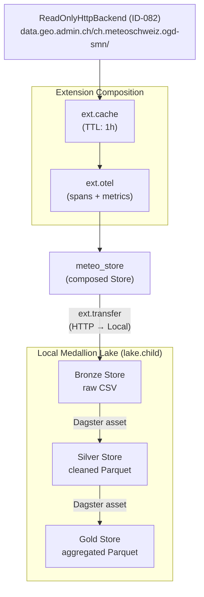
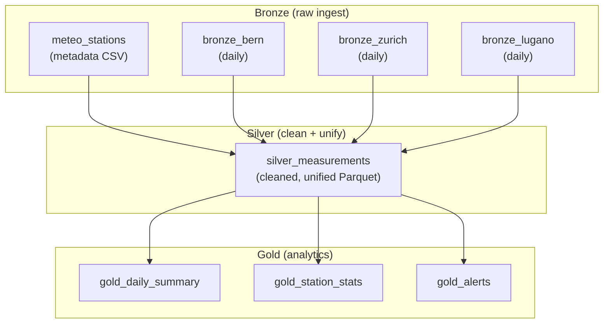

# Architecture: Medallion + Dagster Showcase

**Item ID:** ID-082 (HTTP backend), ID-083 (Dagster extension v2), ID-075
(Dagster extension v1)
**Date:** 2026-03-15
**Status:** Architecture draft — pending ID-082 implementation

---

## 1. Purpose

A runnable showcase demonstrating remote-store's value proposition through a
real-world **medallion architecture** orchestrated by Dagster, using:

- **`ReadOnlyHttpBackend`** (ID-082) to read live Swiss open-government data
- **`ext.cache`** to avoid redundant downloads
- **`ext.observe` / `ext.otel`** to trace every storage operation
- **`ext.transfer`** to move data across backend boundaries
- **`ext.arrow`** to bridge PyArrow/Polars for Parquet I/O
- **`ext.dagster`** to integrate with Dagster's asset framework

The showcase replaces the synthetic SFTP-based approach with real HTTP data
sources, eliminating all artificial infrastructure while demonstrating more
library features.

---

## 2. What This Replaces

The existing notebook `examples/notebooks/04_data_lake_medallion.ipynb` uses
`MemoryBackend` with synthetic sensor data. It's a good tutorial but:

- No network I/O (everything in-process)
- No caching (nothing to cache)
- No observability (nothing crosses a boundary worth tracing)
- No Dagster orchestration (imperative notebook cells)
- No cross-backend transfer (single MemoryBackend)

A previously considered SFTP approach would have required Docker Compose, SSH
keys, and a simulated drop-zone — infrastructure that obscures the library
features it's supposed to showcase.

---

## 3. Data Sources

All data comes from Swiss open-government portals via HTTP. No credentials
required.

### 3.1 MeteoSwiss Automatic Weather Stations (SMN)

**Base URL:** `https://data.geo.admin.ch/ch.meteoschweiz.ogd-smn/`

MeteoSwiss publishes station measurements as CSV via the FSDI (Federal Spatial
Data Infrastructure). URL pattern:

```
https://data.geo.admin.ch/ch.meteoschweiz.ogd-smn/{station}/ogd-smn_{station}_{granularity}.csv
```

| Parameter | Values | Example |
|-----------|--------|---------|
| `{station}` | 3-letter code, lowercase | `ber` (Bern-Zollikofen), `klo` (Zurich-Kloten), `lug` (Lugano) |
| `{granularity}` | `t` (10-min), `h` (hourly), `d` (daily), `m` (monthly), `y` (yearly) | `d` for daily |

**Example URLs:**
- `ber/ogd-smn_ber_d.csv` — Bern daily measurements
- `klo/ogd-smn_klo_d.csv` — Zurich-Kloten daily
- `lug/ogd-smn_lug_d.csv` — Lugano daily

**Metadata files** (at collection root):
- `ogd-smn_meta_stations.csv` — station inventory (coordinates, elevation, name)
- `ogd-smn_meta_parameters.csv` — parameter codes (what each column means)

**Format:** Semicolon-delimited CSV (`;`), decimal separator `.`, timestamps in
UTC. `Content-Length` and `Last-Modified` headers present. Assets cached for 2
hours server-side (10-second cache for 10-min granularity).

### 3.2 Why MeteoSwiss

- **Real data, real quirks** — missing values, station gaps, varying column
  sets across granularities. Cleaning is non-trivial.
- **Static file pattern** — simple `GET` requests, no API keys, no pagination.
  Perfect fit for `ReadOnlyHttpBackend`.
- **Multiple granularities** — daily vs. monthly vs. yearly naturally maps to
  medallion layers (ingest daily, aggregate to monthly in Silver, derive
  analytics in Gold).
- **Known dataset** — MeteoSwiss is referenced in Swiss data engineering
  tutorials; familiar to the target audience.

### 3.3 Future: Additional Sources (Optional)

These are not required for the initial showcase but could enrich it later:

| Source | URL pattern | Data | Use in showcase |
|--------|-------------|------|-----------------|
| LINDAS SPARQL | `POST https://ld.admin.ch/query` with `Accept: text/csv` | Zürich population, municipality stats | Gold-layer enrichment (join weather + population) |
| opendata.swiss | Various CSV download URLs | Swiss statistical datasets | Additional dimension tables |

LINDAS requires a POST request with a SPARQL query body, which doesn't fit
`ReadOnlyHttpBackend`'s GET-only model. If needed, a small helper function
fetches the CSV and writes it to a local Store; the showcase then reads from
that Store. This is an honest pattern — not everything is a backend.

---

## 4. Architecture

### 4.1 Store Topology



### 4.2 Store Construction

```python
from remote_store import Store
from remote_store.backends import LocalBackend, ReadOnlyHttpBackend
from remote_store.ext.cache import cached_store
from remote_store.ext.otel import otel_observe

# --- Source: MeteoSwiss open data (read-only, zero credentials) ---
_http = Store(ReadOnlyHttpBackend(
    base_url="https://data.geo.admin.ch/ch.meteoschweiz.ogd-smn/",
    timeout=60.0,
))
_cached = cached_store(_http, ttl=3600)
meteo_store = otel_observe(_cached)
# Access cache stats after Bronze ingestion: _cached.stats

# --- Sink: local medallion lake ---
lake = Store(LocalBackend(root="./data/showcase"))
bronze = lake.child("bronze")
silver = lake.child("silver")
gold = lake.child("gold")
```

**Key design choices:**

1. **`ext.cache` with 1-hour TTL.** MeteoSwiss caches assets server-side for
   2 hours. Our 1-hour client TTL means re-materialization within the hour
   hits the cache, but we still pick up new data within 2 server cycles.
   This is a real optimization — not a toy demo.

2. **`ext.otel` wraps the cached store.** Traces show cache hits vs. actual
   HTTP requests, making the caching benefit visible in the OTel dashboard.

3. **`lake.child()` for layer isolation.** Same backend, separate namespaces.
   Identical to the existing notebook pattern.

4. **`LocalBackend` for the lake.** The showcase runs locally with zero cloud
   credentials. Users swap to S3/Azure by changing one line. This is the
   same "swap the backend" story the existing notebook demonstrates, but now
   the source is also a real remote backend.

### 4.3 Extension Composition Chain

The showcase demonstrates this composition, from innermost to outermost:

| Layer | Extension | What it adds |
|-------|-----------|--------------|
| 1 (inner) | `ReadOnlyHttpBackend` | `GET`/`HEAD` to data.geo.admin.ch |
| 2 | `ext.cache` | TTL-based read caching (avoids re-download) |
| 3 (outer) | `ext.observe` (via `otel_observe`) | OTel spans + metrics on every op |
| cross-store | `ext.transfer` | Stream data from HTTP store to local store |
| bridge | `ext.arrow` (`pyarrow_fs`) | Expose local store as PyArrow filesystem |
| orchestration | `ext.dagster` | Dagster IO manager for Silver/Gold assets |

This is 6 extensions composing naturally. No glue code, no adapters, no
monkey-patching. That's the story.

---

## 5. Dagster Asset Graph

### 5.1 Assets



### 5.2 Asset Definitions (Sketch)

```python
from dagster import asset, AssetKey
from remote_store.ext.transfer import transfer
from remote_store.ext.dagster import remote_store_io_manager

STATIONS = {"ber": "Bern-Zollikofen", "klo": "Zurich-Kloten", "lug": "Lugano"}

# --- Bronze: raw ingest via ext.transfer ---

@asset(group_name="bronze")
def meteo_stations() -> None:
    """Download station metadata CSV from MeteoSwiss."""
    transfer(meteo_store, "ogd-smn_meta_stations.csv",
             bronze, "meta/stations.csv", overwrite=True)

@asset(group_name="bronze")
def bronze_bern() -> None:
    """Ingest Bern daily weather data."""
    transfer(meteo_store, "ber/ogd-smn_ber_d.csv",
             bronze, "stations/ber/daily.csv", overwrite=True)

@asset(group_name="bronze")
def bronze_zurich() -> None:
    """Ingest Zurich-Kloten daily weather data."""
    transfer(meteo_store, "klo/ogd-smn_klo_d.csv",
             bronze, "stations/klo/daily.csv", overwrite=True)

@asset(group_name="bronze")
def bronze_lugano() -> None:
    """Ingest Lugano daily weather data."""
    transfer(meteo_store, "lug/ogd-smn_lug_d.csv",
             bronze, "stations/lug/daily.csv", overwrite=True)

# --- Silver: clean + unify ---

@asset(
    group_name="silver",
    io_manager_key="silver_io_manager",
    deps=[AssetKey("bronze_bern"), AssetKey("bronze_zurich"),
          AssetKey("bronze_lugano"), AssetKey("meteo_stations")],
)
def silver_measurements() -> pl.DataFrame:
    """Clean and unify all station data into a single Parquet dataset.

    - Parse timestamps (UTC)
    - Normalize semicolon-delimited CSV to columnar Parquet
    - Map parameter codes to human-readable names via metadata
    - Drop rows with missing critical measurements
    - Deduplicate by (station, timestamp, parameter)
    - Add station metadata (name, elevation, coordinates)
    """
    ...  # Implementation reads from bronze store, returns cleaned DataFrame

# --- Gold: analytics ---

@asset(group_name="gold", io_manager_key="gold_io_manager", deps=[AssetKey("silver_measurements")])
def gold_daily_summary() -> pl.DataFrame:
    """Daily aggregates per station: avg/min/max temperature, precipitation sum."""
    ...

@asset(group_name="gold", io_manager_key="gold_io_manager", deps=[AssetKey("silver_measurements")])
def gold_station_stats() -> pl.DataFrame:
    """Per-station statistics: data coverage, mean elevation-adjusted temp."""
    ...

@asset(group_name="gold", io_manager_key="gold_io_manager", deps=[AssetKey("silver_measurements")])
def gold_alerts() -> pl.DataFrame:
    """Flag days where measurements exceed thresholds (heat, frost, wind)."""
    ...
```

### 5.3 IO Manager Integration

```python
from dagster import Definitions
from remote_store.ext.dagster import remote_store_io_manager

defs = Definitions(
    assets=[meteo_stations, bronze_bern, bronze_zurich, bronze_lugano,
            silver_measurements, gold_daily_summary, gold_station_stats,
            gold_alerts],
    resources={
        "silver_io_manager": remote_store_io_manager(silver, serializer="parquet"),
        "gold_io_manager": remote_store_io_manager(gold, serializer="parquet"),
    },
)
```

**Note on Bronze assets:** Bronze assets use `ext.transfer` directly (no IO
manager) because they're raw file ingestion, not DataFrame serialization. This
is intentional — it shows both integration patterns.

### 5.4 Why Not Use IO Manager for Bronze?

Bronze ingestion is a file-level `transfer()` (CSV from HTTP to local). The IO
manager's serialize/deserialize model assumes Python objects, not raw file
copies. Using `ext.transfer` for Bronze and `ext.dagster` IO manager for
Silver/Gold demonstrates that both patterns coexist naturally.

---

## 6. What Each Extension Demonstrates

### 6.1 `ReadOnlyHttpBackend` (ID-082)

- Backend with only `{READ, METADATA}` capabilities — first read-only backend
- `store.read("ber/ogd-smn_ber_d.csv")` fetches live data from
  `data.geo.admin.ch`
- `store.exists()` uses HTTP `HEAD`
- `store.get_file_info()` returns `Content-Length`, `Last-Modified`, `ETag`
- Write/delete/list raise `CapabilityNotSupported` with clear messages

### 6.2 `ext.cache`

- Without cache: every Dagster re-materialization re-downloads ~100KB CSVs
- With cache (1h TTL): first run downloads, subsequent runs within the hour
  hit cache
- `cached_store.stats` shows hit/miss ratio — visible in logs
- The showcase prints cache stats after Bronze ingestion to make the benefit
  concrete

### 6.3 `ext.observe` / `ext.otel`

- Every `read()`, `exists()`, `get_file_info()` emits an OTel span
- Span attributes: `remote_store.operation`, `remote_store.backend`, `remote_store.path`
  (duration is inherent in the span itself)
- Counter metrics: `remote_store.operations`, `remote_store.errors`
- Duration histogram: `remote_store.operation.duration` (unit: seconds)
- The showcase includes a minimal OTel setup (console exporter) so traces are
  visible in terminal output without requiring Jaeger/Grafana

### 6.4 `ext.transfer`

- `transfer(meteo_store, src_path, bronze, dst_path)` streams HTTP response
  directly to local file
- Cross-backend transfer: HTTP → Local (Bronze), or HTTP → S3 with one config
  change
- `on_progress` callback shows download progress

### 6.5 `ext.arrow` / `pyarrow_fs`

- `pyarrow_fs(silver)` exposes the local Silver store as a PyArrow filesystem
- `pq.write_table(table, "measurements.parquet", filesystem=silver_fs)` writes
  Parquet through the Store abstraction
- DuckDB reads Parquet through the same PyArrow bridge

### 6.6 `ext.dagster`

- `remote_store_io_manager(store, serializer="parquet")` wraps any Store as
  a Dagster IO manager
- Silver/Gold assets return DataFrames; the IO manager handles
  serialization to Parquet and storage to the correct path
- Asset materialization metadata shows path and size

---

## 7. File Layout

```
examples/
  medallion_dagster/
    README.md                   # Setup instructions, what it demonstrates
    definitions.py              # Dagster Definitions (assets, resources, jobs)
    stores.py                   # Store construction (HTTP + cache + otel + local)
    assets/
      bronze.py                 # Bronze assets (HTTP → local via ext.transfer)
      silver.py                 # Silver assets (clean, unify, Parquet)
      gold.py                   # Gold assets (aggregation, alerts)
    otel_setup.py               # Minimal OTel console exporter configuration
    pyproject.toml              # Showcase-specific deps (dagster, polars, etc.)
```

The showcase is a self-contained Dagster project. Users run it with:

```bash
cd examples/medallion_dagster
pip install -e "../../[dagster,arrow,otel]" polars duckdb
dagster dev -f definitions.py
```

### 7.1 Why a Separate Directory (Not a Notebook)

- Dagster needs a `Definitions` object in a Python module, not notebook cells
- The asset graph is the demo — Dagster's web UI visualizes it
- Users can `dagster dev` and see the full pipeline in their browser
- The existing notebook (`04_data_lake_medallion.ipynb`) remains as the
  "no Dagster, no network" tutorial

---

## 8. OTel Setup (Minimal, No External Services)

```python
# otel_setup.py
from opentelemetry import trace, metrics
from opentelemetry.sdk.trace import TracerProvider
from opentelemetry.sdk.trace.export import (
    SimpleSpanProcessor,
    ConsoleSpanExporter,
)
from opentelemetry.sdk.metrics import MeterProvider
from opentelemetry.sdk.metrics.export import (
    ConsoleMetricExporter,
    PeriodicExportingMetricReader,
)

def configure_otel() -> None:
    """Set up OTel with console exporters (no Jaeger/Grafana needed)."""
    trace.set_tracer_provider(TracerProvider())
    trace.get_tracer_provider().add_span_processor(
        SimpleSpanProcessor(ConsoleSpanExporter())
    )
    metrics.set_meter_provider(MeterProvider(
        metric_readers=[PeriodicExportingMetricReader(
            ConsoleMetricExporter(), export_interval_millis=10_000
        )]
    ))
```

Users see OTel output in the terminal alongside Dagster logs. For production,
swap `ConsoleSpanExporter` for `OTLPSpanExporter` pointing at Jaeger/Tempo.

---

## 9. Dependencies

### 9.1 Showcase-specific (not added to remote-store core)

| Package | Version | Purpose |
|---------|---------|---------|
| `dagster` | `>=1.9` | Orchestration, asset framework, web UI |
| `dagster-webserver` | `>=1.9` | `dagster dev` web UI |
| `polars` | `>=0.20` | DataFrame transforms (Silver, Gold) |
| `duckdb` | `>=0.10` | Ad-hoc Gold queries (optional) |
| `opentelemetry-sdk` | `>=1.20` | OTel trace/metrics SDK |
| `opentelemetry-exporter-otlp` | `>=1.20` | Optional: OTLP export |

### 9.2 remote-store extras used

```bash
pip install "remote-store[dagster,arrow,otel]"
```

- `[dagster]` — ext.dagster (IO manager adapter)
- `[arrow]` — ext.arrow (PyArrow filesystem bridge) + ParquetSerializer
- `[otel]` — ext.otel (OpenTelemetry instrumentation)

No `[httpx]` or `[requests]` extra needed — the HTTP backend's urllib
baseline works with zero additional deps.

---

## 10. Sequencing and Prerequisites

### 10.1 Hard Prerequisites

| Prerequisite | Status | Blocks |
|--------------|--------|--------|
| ID-082: `ReadOnlyHttpBackend` (urllib baseline) | In progress (parallel) | Bronze assets, all HTTP reads |
| ID-082: Conformance suite capability gates | In progress (parallel) | Backend registration |
| Backend registry entry for `"http"` | Part of ID-082 | `from_dict()` config support |

### 10.2 Already Done

| Item | Status |
|------|--------|
| ID-075: `ext.dagster` v1 (IO manager adapter) | Shipped in v0.17.0 |
| `ext.cache` | Shipped |
| `ext.observe` / `ext.otel` | Shipped |
| `ext.transfer` | Shipped |
| `ext.arrow` / `pyarrow_fs` | Shipped |
| `Store.child()` | Shipped |

### 10.3 Implementation Order

1. **Wait for ID-082** — HTTP backend with urllib transport
2. **`stores.py`** — Store construction with full composition chain
3. **`assets/bronze.py`** — HTTP → local transfer assets
4. **`assets/silver.py`** — CSV → cleaned Parquet transforms
5. **`assets/gold.py`** — Aggregation assets
6. **`definitions.py`** — Dagster wiring
7. **`otel_setup.py`** — Console exporter config
8. **`README.md`** — Setup and walkthrough
9. **Verify end-to-end** — `dagster dev`, materialize all, check OTel output

---

## 11. What the Showcase Proves

| Claim | Evidence |
|-------|----------|
| "Unified interface across backends" | Same `Store` API reads from HTTP and writes to local |
| "Composable extensions" | 6 extensions stacked without conflict |
| "Zero-config backend swap" | Change `LocalBackend` to `S3Backend` → same pipeline |
| "Works with real data" | Live MeteoSwiss measurements, not synthetic |
| "Production-grade observability" | OTel spans on every operation |
| "Caching matters" | Cache stats prove repeated reads don't re-download |
| "Dagster integration is thin" | 3-line IO manager setup, not a framework rewrite |
| "Read-only backends are first-class" | HTTP backend works naturally in the capability system |

---

## 12. Risks and Mitigations

| Risk | Likelihood | Impact | Mitigation |
|------|-----------|--------|------------|
| MeteoSwiss changes URL structure | Low | Medium | Pin known-good URLs in README; add fallback to cached sample data |
| MeteoSwiss rate-limits or blocks | Low | Medium | `ext.cache` TTL reduces requests; urllib sends no unusual headers |
| ID-082 ships with breaking API changes | Low | Low | Showcase is downstream; adapts to final API |
| CSV format changes (columns, delimiter) | Low | Medium | Silver cleaning code is explicit about expected format; fails loudly |
| Dagster version incompatibility | Medium | Low | Floor at `dagster>=1.9`; tested against latest |
| OTel setup complexity deters users | Low | Low | Console exporter = zero infrastructure; optional section |

---

## 13. Non-Goals

- **Cloud deployment.** The showcase runs locally. Cloud deployment is the
  user's problem (and remote-store makes it easy via backend swap).
- **Production-grade error handling.** The showcase prioritizes clarity over
  resilience. No retry loops, no dead-letter queues.
- **Complete MeteoSwiss coverage.** Three stations, one granularity. Enough
  to demonstrate the pattern without overwhelming.
- **Dagster sensors or schedules.** Assets are materialized manually via the
  UI or CLI. Sensor-based triggering is a Dagster concern, not a
  remote-store one.
- **Performance benchmarking.** The showcase is about correctness and
  composability, not throughput.

---

## 14. Relationship to Existing Notebook

The existing `04_data_lake_medallion.ipynb` and this showcase are
complementary:

| Aspect | Notebook | Showcase |
|--------|----------|----------|
| Orchestration | None (imperative cells) | Dagster asset graph |
| Data source | Synthetic (generated in code) | Live HTTP (MeteoSwiss) |
| Backend | MemoryBackend | HTTP (source) + Local (lake) |
| Extensions used | `ext.arrow` | `ext.cache`, `ext.observe`, `ext.otel`, `ext.transfer`, `ext.arrow`, `ext.dagster` |
| Network I/O | None | Real HTTP requests |
| Prerequisites | `pip install "remote-store[arrow]" polars duckdb` | `pip install "remote-store[dagster,arrow,otel]" polars dagster-webserver` |
| Audience | "What is medallion + remote-store?" | "How does remote-store work in a real pipeline?" |

The notebook is the tutorial. The showcase is the proof.
