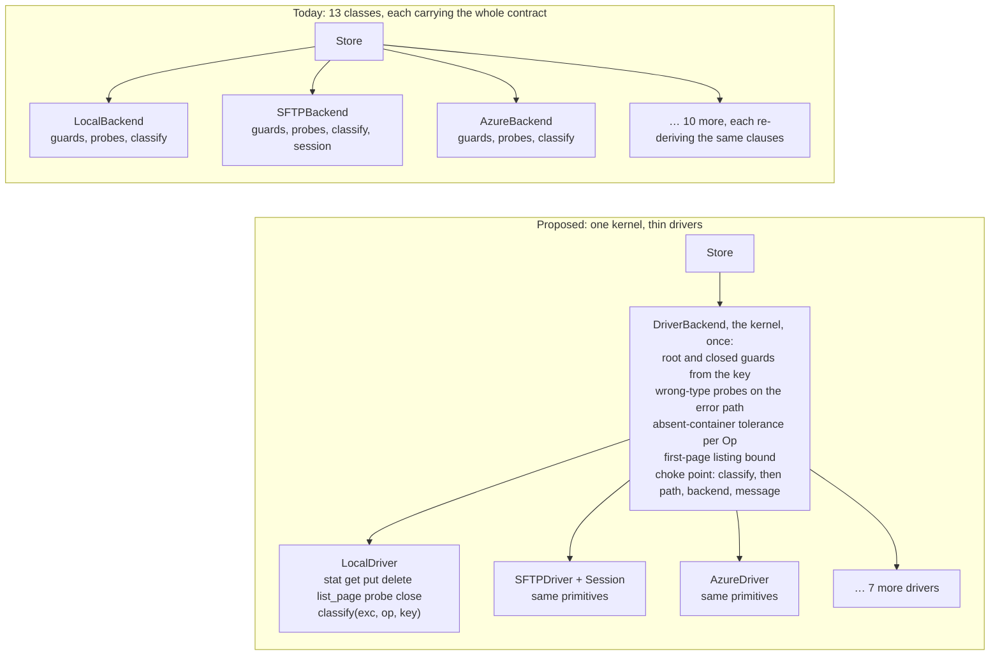
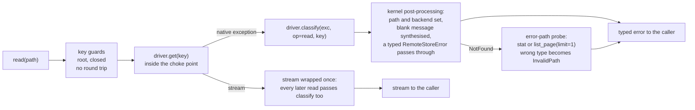

# RFC-0017: One contract kernel over thin drivers

## Status

Draft. Filed from [audit-021](../audits/audit-021-contract-placement.md) at
the user's direction. Deliberately untracked by a backlog item: `CLAUDE.md`
§ Audits leaves the disposition of an audit's proposals to the user, and the
item is minted with that disposition; RFC-0015 and RFC-0016 were tracked
because their work had started. The lifecycle this RFC follows, and what it
amends on acceptance, are in D8 and § Impact.

**Date:** 2026-09-28. Every figure below is pinned to `8fa22d6` and is either
quoted from audit-021 with its derivation, or names its command here. The tree
moves on every merge: re-run rather than quote.

## Summary

This RFC proposes that the `Backend` surface be implemented **once**, in a
concrete `DriverBackend(Backend)` kernel over a per-backend `Driver` of
fourteen required wire primitives and nine optional ones, with error mapping
at a single choke point that invokes the driver's operation-scoped
`classify(exc, op, key)` on every call, listing page and stream and
guarantees the error's `path`, `backend` and a non-empty message.

Today every backend class implements the surface by hand, 10 sync classes × 21
I/O methods plus 3 async classes × 19, and re-derives the contract's
cross-cutting clauses inside each method. Audit-021 attributes 45 of the 71
user-audience defects of the last six releases (63%) to rules stated once and
re-implemented per class; measured against this design by the rules in § What
each cluster-A bug becomes, the kernel owns 10 of those outright (14% of the
71), 6 are split with the driver, 8 stay in the driver, 6 wait on a decision,
2 disappear with a retired class, and 13 belong to D5's session layer. Counted
by clause rather than by item, the 45 sit on 14 clauses (11 in cluster A, 3 in
B); the audit derives no clause count for the other 26, so the 14 has no
share. The 63% is the audit's diagnosis of the placement; the 14% is what this
kernel alone removes, and the rest of the proposal (the session layer, one
driver per service, the wire-signal question) is sized against the remainder.
`Store`, `Registry`, the error hierarchy and capabilities keep their
interfaces; the conformance suite is the migration's oracle, with the cells
that change enumerated before the first migration.

## Motivation

### The bug population is the contract, re-implemented

Audit-021 § H-1 carries the register and the figures; the two that decide the
design are these. **The same clause is fixed N times:** 14 of cluster A's 35
entries name two or more classes, and BUG-259 changed eight classes on two
halves of one rule that binds eleven. **The fix lands per method, so it is
missed per method:** BUG-249 was three listing methods on one class left
unwrapped "against fifteen methods that do wrap"; BUG-280 is the same shape on
`LocalBackend`; BUG-293 is twelve `except` arms across the two Azure classes;
BUG-276 is seven sites in five files.

The eight shared guard helpers are called on 164 lines across 10 files and
wrapped per class 22 times (audit-021 commands (e) and (g)), the source
carries 395 `except` handlers, and `Store` catches nothing: the never-leak
invariant of BE-021 is asserted inside each of the 13 classes and zero times
at the boundary every call crosses. BE-021 itself is 497 lines of prose
(spec 003 lines 676 to 1172 inclusive) stating what one function should do.

### The remedies already tried were tests, static checks and spec text

The bug-prevention research (2026-04-03) and the contract-completeness research
(2026-04-05) diagnosed the same cross-product. The first prescribed seven
deliverables, of which six exist (`_safe_wrap`, the property-based tests, ruff
`BLE`, the extended conformance cells, the `ResourceWarning` sites; audit-021
§ H-1 names each one's location) and one, an AST check over broad `except`
arms in the backends, was deferred and never built. The second prescribed
tightened clauses, and BE-021 reached 497 lines; the conformance suite reached
323 test functions. Cluster A still produced 35 defects in six releases, 13 of
them closed in v0.31.0 alone (audit-021 § Summary carries the per-release
series and its review-chain confound). A test fails only on the cell it covers, and
the contract-completeness research's own estimate of the product
(`research-backend-contract-completeness.md` § 3) was ~1,890 cells at 7
backends and 18 methods, ~3,510 by the same formula at 13 classes, treating
the three async twins as classes. That scaling counts the backend axis only;
the driver × wire half of the product stays with the per-driver suites
(§ Impact, Risks). Removing the backend axis from the kernel's half is the
change that alters the count; covering the product does not. The unbuilt
static check is taken up under § Alternatives.

### The repo is already half way there

`_S3Base` (RFC-0005, BK-011), `_flat_ns.py` (ID-211; 495 lines of guards
applied by injection), `_safe_wrap` (BUG-159), `_ErrorMappingStream(mapper=...)`
and `AsyncBackendSyncAdapter` (ADR-0025) each share one piece of the contract
across some classes. None reaches all 13 and none owns the method bodies.
RFC-0005 is the direct antecedent: it extracted `_S3Base` as deduplication and
stopped at the S3 family. This RFC finishes that move rather than starting a
new one.

## Proposal

### The shape in one picture

Today each class is the whole contract; the proposal puts the contract in one
kernel and leaves each class a driver of wire primitives plus one classifier.



The kernel is generic over the driver, so the fourteen primitives and the
classifier are all a new backend writes, and every clause in the kernel box
is applied to it without being restated.

### D1. A `Driver` of wire primitives, with capabilities declared, not derived

A driver maps one-to-one onto its wire protocol and carries no path, root,
type, closed or mapping logic. Fourteen required callables and five
attributes:

```python
class Driver(Protocol):
    name: str
    namespace: Literal["flat", "hierarchical"]
    parents: Literal["none", "implicit", "explicit"]  # HTTP none; Graph, Azure HNS implicit; Local, SFTP explicit
    capabilities: CapabilitySet   # declared by the driver, as a backend's CAPABILITIES ClassVar is today (SEEK-001's shape); the kernel adds none
    put_is_atomic: bool           # S3, SQL, flat Azure True (write_atomic is put); Local, SFTP False

    def stat(self, key: str) -> Entry | None: ...        # file OR folder, kind on the Entry; None if absent
    def get(self, key: str) -> BinaryIO: ...
    def put(self, key: str, content, *, overwrite: bool, metadata) -> WriteResult: ...
    def delete(self, key: str) -> None: ...
    def list_page(self, prefix: str, *, delimiter: str | None, cursor, limit: int | None) -> Page: ...
    def probe(self) -> None: ...                         # health; must touch the container
    def close(self) -> None: ...

    def classify(self, exc: Exception, *, op: Op, key: str) -> RemoteStoreError: ...
    def container_absent(self, exc: BaseException, *, op: Op) -> bool: ...
    def connection_dead(self, exc: BaseException) -> bool: ...

    # interop, forwarded by the kernel unchanged (BE-022, BE-023, BE-025, resolve)
    def unwrap(self, type_hint: type[T]) -> T: ...
    def native_path(self, key: str) -> str: ...
    def to_key(self, native_path: str) -> str: ...
    def resolve(self, key: str) -> ResolutionPlan: ...
```

Nine optional protocols, each a separate `runtime_checkable` `Protocol`
checked once at kernel construction (a `typing.Protocol` cannot express an
optional member, so presence is a protocol, not a method):

| Protocol | Member | What the kernel does with it, and without it |
|---|---|---|
| `SupportsRangeRead` | `get_range(key, offset, length)` | serves `read_seekable` by ranged reads (Azure's `_AzureRangeReader`, the boto3 lane's `_S3RangeReader`); without it, spools over `get` as the ABC default does today |
| `SupportsOpenWrite` | `open_write(key, *, metadata) -> WriteHandle` with `commit()` and `abort()` | serves `open_atomic` on a wire-side temporary (S3 multipart Complete/Abort, Local and SFTP temp files); without it, spools locally and `put`s at exit, which is ADR-0025's synthesis and what flat Azure does today |
| `SupportsAtomicMove` | `move(src, dst, *, overwrite)` | forwarded whole; **required** when the driver declares `ATOMIC_MOVE` (SQLBlob's single transaction, Memory's single lock), so the kernel never sequences the checks of an atomic move |
| `SupportsRename` | `rename(src, dst, *, replace: bool)` | `move` for drivers without an atomic move: `replace=True` where the wire replaces (`os.replace`), `replace=False` where it cannot, in which case the kernel runs the displace-and-restore fallback SFTP carries today, and only there |
| `SupportsCopy` | `copy(src, dst)` | `copy`, and `move` as copy-then-delete when neither of the two above exists |
| `SupportsDeleteTree` | `delete_tree(prefix)` | `delete_folder(recursive=True)` in one wire call (Graph's single DELETE, Azure HNS `delete_directory`, SQL's one transactional `DELETE … LIKE`, S3 `DeleteObjects` in batches of 1000); without it, list then delete |
| `SupportsEnsureParents` | `ensure_parents(key)` | called before `put` when `parents == "explicit"`; SFTP's stat walk and Local's `mkdir -p` are their implementations. Never called for `implicit` (Graph, GR-039: no explicit `mkdir`; Azure HNS) or `none` |
| `SupportsFolderStats` | `folder_stats(prefix) -> (count, size, latest)` | `get_folder_info` push-down (SQL's aggregate query); without it, the kernel aggregates a listing |
| `SupportsGlob` | `glob(pattern)` | native `GLOB`; without it the driver must not declare `GLOB` |

Two more attributes the stream wrapper reads per driver, because
`_ErrorMappingStream`'s caught set is per construction site today:
`stream_catch: tuple[type[BaseException], ...]` (SFTP's paramiko shapes) and
`size_probe` (the `SEEK_END` resolver BK-357 added).

**Capabilities are the driver's declaration, and the kernel validates rather
than derives.** Deriving a flag from a member's presence contradicts the
capabilities as defined: `SEEKABLE_READ` means "`read()` always returns a
seekable stream" (spec 006 SIO-008; `_capabilities.py` L75), which Memory and
the SQL backends hold with no range primitive and Azure lacks with one; and
CAP-007 (spec 003 line 47) says a backend that implements move as
copy-then-delete does not declare `ATOMIC_MOVE`, and `sftp` omits it
(`_SFTP_CAPABILITIES`, `_sftp.py` line 48) although it has a rename.
So the driver declares its `CapabilitySet` exactly as a backend does today,
and at construction the kernel checks consistency in one direction only:
`ATOMIC_MOVE` requires `SupportsAtomicMove`; `ATOMIC_WRITE` requires
`put_is_atomic`, `SupportsOpenWrite`, or `SupportsRename` with `replace=True`
for a temp-and-promote; `GLOB` requires `SupportsGlob`; `COPY` requires
`SupportsCopy`. The kernel synthesises `move`, `open_atomic`, `read_seekable`
and `delete_folder` from what is present and never adds a flag. A driver that
omits `get_range` or `open_write` therefore keeps its declared capabilities
and loses a data path; § Impact names where that lands.

`Entry` (key, kind `file | folder`, size, modified, etag, metadata), `Page`
(entries, common prefixes, next cursor) and `WriteHandle` are small records.
`Op` is an enum of the public operations plus the kernel's internal scopes
(`probe`, `identity`, `monitor`), so a driver can classify by what asked:
today every classifier already takes `path` (ERR-001), Graph's
`classify_graph_error` takes a `scope` that decides whether a `404` is an
absent item or an absent drive
([ADR-0038](../adrs/0038-absent-container-outranks-drive-identity.md),
BK-266), and Azure routes listings and file operations through different
context managers. A `classify(exc)` with no scope could not reproduce either
and would re-open BUG-248; the scope is therefore part of the primitive, and
the driver, not the kernel, decides what an identity-scope failure means.

**`classify` may perform I/O, and the kernel says where it runs.** SQL's
dropped-table detection is an inspector round trip, SFTP classifies with a
`stat`, Local on Windows maps `PermissionError` through `is_dir()`. For a D5
driver the kernel invokes `classify` inside `Session.run`, so a classifier
that touches the connection cannot re-enter the reconnecting accessor
(BUG-274's and BUG-278's shape); for the others it runs in the choke point
with no retry, per ADR-0011's per-backend retry, which stays the driver's.
`ReadOnlyHttpBackend`'s driver raises an `HttpStatusError(status)` from its
primitives, since its failures are status codes rather than exceptions.

### D2. One kernel is a `Backend`

`DriverBackend(Backend)` implements the 21 methods audit-021 command (a)
names (`close` and `check_health` among them) over a driver and forwards the
other 6 public members (`name`, `capabilities`, `unwrap`, `native_path`,
`to_key`, `resolve`). `Backend` has 27 public `def`s, lines 68 to 578 of
`_backend.py` by `rg -n '^    def [a-z]' _backend.py`, whose 28th match is
`_SeekableSpool.seekable` at line 44, above `class Backend`. It owns, once:

- root refusal from the key (BE-029, both predicates as `_flat_ns` now states
  them), and the closed guard, in the order spec 003 fixes; these are
  key-level checks and add no round trip;
- the wrong-type probes on the error path (one `stat` and one
  `list_page(limit=1)`, the same probes the classes issue today), the
  absent-container tolerance, and the first-page listing bound (BE-021),
  including its page-not-item rule;
- the file-ancestor pre-check as a kernel option with today's default: the
  opt-in `reject_write_under_file_ancestor` moves from each flat-namespace
  class to the kernel's constructor, default off, and the walk runs in the
  kernel before any `put` when set. Its fail-open policy is BUG-292's open
  decision and the kernel applies whichever BE-008 chooses;
- the `max_depth` reference algorithm, decided once (Open Question 4 names
  BUG-240 as the contradiction to adjudicate before the kernel encodes it);
- `write_atomic` as `put` where `put_is_atomic`, as `open_write` + `commit`
  where that exists, else as `put` to a temp key + `rename(replace=True)`;
  never a PUT + CopyObject + DELETE on a store whose PUT is already atomic
  (S3, SQL, flat Azure today all implement `write_atomic` as plain `write`);
- `move` as D1's table states, so an `ATOMIC_MOVE` driver's move is never
  sequenced by the kernel, and displace-and-restore runs only for a
  `replace=False` rename;
- error mapping at a single choke point: every driver call, every `list_page`
  iteration and every stream handed back by `get` or `get_range` passes
  through `driver.classify(exc, op=..., key=...)`; a `RemoteStoreError`
  already typed passes through untouched (BUG-293); and the kernel
  post-processes what comes back, setting `path` and `backend` (ERR-001) and
  synthesising a message from the exception class when the driver returned a
  blank one (ERR-009), which is the "synthesise" arm of BUG-276's open
  decision and is applied only if that decision goes that way;
- the absent-container rule applied per operation scope, not per exception:
  the tolerant answers BE-021 § Reach decides are given only for the
  operations it names, and identity-scope calls (`write`, `probe`, drive-id
  resolution, the copy/move monitor) hand the driver an `Op` it may escalate,
  which is ADR-0038's ruling kept rather than overridden.

One call through the kernel, `read` as the example; every other operation
takes the same path with its own primitive and `Op`:



**What `Backend` is afterwards.** `Backend` stays the abstract contract type
every caller and every test names; the kernel is one concrete subclass.
Subclassing `Backend` directly stays valid and keeps passing the conformance
suite; it is deprecated as the way to add a backend, not removed. The
consequences for the in-tree subclasses that are not among the 13, enumerated
by `rg '^class \w+\(.*\b(Backend|AsyncBackend)\b' src tests examples`: 21
matches, of which 9 are concrete backends (the other 4 of the 13 subclass
`_S3Base` or `_SQLAlchemyBaseBackend`) and these 12 are not. The `^class`
anchor misses five indented subclasses, by the same regex with `^\s+class`:
three fakes that stay as they are (`tests/test_info.py`, a second one in
`tests/ext/test_arrow.py`, a docstring example in
`_async_to_sync_adapter.py`) and two published snippets that § Impact lists
(`MyBackend` in `examples/snippets/homepage.py`, the landing page's example
of adding a backend, and `_ReadOnlyBackend` in the guide's
`partial-capabilities` region). The 12:
`_S3Base` retires with its two lanes (D4); `_SQLAlchemyBaseBackend` becomes
the shared part of the two SQL drivers; `AsyncBackendSyncAdapter(Backend)`
and `SyncBackendAdapter(AsyncBackend)` stay direct subclasses, since each is
the other runtime's face of a backend and not a backend of its own (D6
decides whether the first also becomes the sync kernel over an async driver);
`DafnyOracleBackend` stays a direct subclass by design (D7); the fake in
`tests/ext/test_arrow.py`, the two fakes in
`tests/scripts/test_dafny_classorder.py` and the three doubles under
`tests/aio/` stay as they are; `RedisBackend` in
`examples/snippets/custom_backend_guide.py` is rewritten as a driver, and
`scripts/check_custom_backend_guide.py` (BK-320), which gates the guide
against `Backend.__abstractmethods__`, is re-pointed at `Driver`.

### D3. Migration, one class at a time, with the suite as oracle

The kernel lands beside the existing classes. A class that migrates becomes a
driver in its own PR, green when the conformance suite passes for its fixture
with the cell changes enumerated below and no others. Not every class
migrates; the fate of each of the 13 is fixed here so that D3 and D4 cannot
disagree:

| Step | Class | Fate |
|---|---|---|
| 1 | `MemoryBackend`, `AsyncMemoryBackend` | migrate first: the simplest drivers, and the oracle's counterparts (D7) |
| 2 | `S3Boto3Backend` | migrate: the S3 driver, with the D4 promotion list |
| 3 | `SQLBlobBackend`, `SQLQueryBackend` | migrate |
| 4 | `AsyncAzureBackend` | migrate: the Azure driver |
| 5 | `LocalBackend` | migrate |
| 6 | `SFTPBackend` | migrate, together with D5 |
| 7 | `GraphBackend` | migrate |
| 8 | `ReadOnlyHttpBackend` | migrate |
| in 2 | `S3Backend`, `S3PyArrowBackend` | retire, unmigrated, in the step-2 PR behind D8's gate; `_S3Base` goes with them |
| in 4 | `AzureBackend` (sync) | retire, unmigrated, **conditional on Open Question 1**, in the step-4 PR behind the same gate |

**The suite is not "unchanged"; the cells that change are these, and they
are settled before step 1.** AZ-025's blank-message clause and its pinning
test go red if BUG-276's decision is "synthesise" (`sdd/BACKLOG.md` BUG-276
says so); the BUG-240 and BUG-292 decisions change cells on the classes that
follow the losing reading; Graph's `get_folder_info().modified_at` differs
from S3 and SQL and the kernel picks one aggregation; and the conformance
registry (`tests/backends/fixtures/registry.py`) registers drivers rather than
classes. The capability enum (CAP-001), the quality-flag rule (CAP-007) and
the declaration clause (SEEK-001) do not change, because D1 leaves
capabilities declared. The three retiring classes are never migrated: each is deleted in
the PR that lands its replacement (D8 step 3), so no release ships both, and
they are outside D8's measurement. Nothing above `Backend` changes at any
step.

### D4. One driver per service

- **S3.** Promote the parked `S3Boto3Backend` (ID-202) as the S3 driver: it
  is standalone, boto3-only, and the lane spec 003 already cites as "the shape
  a fix takes" for the first-page bound. It is today wheel-excluded,
  unregistered and conformance-tested on moto only, so promotion is a list,
  not a rename, and every item is a precondition of the retirement gate (D8
  step 3, condition (c)):
  ID-202 § 4a's Ship items (an `S3B-*` spec block replacing the borrowed
  `S3-015/016/018` marks; a SEEK-004 amendment dropping the lane from the
  passthrough list and an `S3B-*` axiom for its `read_seekable`; the
  write-over-prefix divergence from the s3fs lane stated or closed;
  multipart copy for objects over 5 GB, since `copy_object` is single-part);
  ID-202 § 6's wiring (the `s3-boto3` extra, `_registry.py`, `_info`,
  `__all__`, `FEATURES.md`, an async variant, a guide, a CHANGELOG entry);
  option parity for what the s3fs lane forwards today through
  `client_options` (`anon`, `requester_pays`, `s3_additional_kwargs` for SSE,
  `profile`), which the boto3 lane does not honour; a MinIO or live lane
  beside moto; and continuity of `name == "s3"` for the registered type, so
  `error.backend` and the observe labels do not change. What does change and
  is stated: `unwrap(s3fs.S3FileSystem)` becomes `unwrap` of the boto3
  client, and `ext.arrow`'s Tier-1 native PyArrow probe, which fires only on
  `S3PyArrowBackend` (`unwrap(pyarrow.fs.FileSystem)`, `_s3_pyarrow.py` line
  536; `S3Backend.unwrap` answers `s3fs.S3FileSystem` alone, `_s3.py` line
  545), no longer fires on S3 once that lane retires, so `ext/` is not
  unchanged (§ Impact). The kernel subsumes the
  `_S3Base` refactor ID-202 § 4 names, rather than being it.
  `S3PyArrowBackend` exists for data-path throughput (its docstring: "Uses
  PyArrow's C++ S3 filesystem for data-path operations (higher throughput)";
  RFC-0003 tuned that path), so retiring it is a performance change measured
  under § Impact before the gate opens.
- **Azure.** Keep one driver, the async one, and decide under Open
  Question 1 how sync callers reach it. If OQ1 chooses a generated sync
  driver, the hand-written sync class is replaced by the generated one and
  keeps its behaviour; if OQ1 chooses the adapter, sync Azure callers move to
  `AsyncBackendSyncAdapter`, which takes an `AsyncBackend`, so this reading
  also requires an async kernel (D6, first option), and it changes what they
  get in the six ways § Impact lists. The retirement row in D3 is conditional
  on that answer. `GraphBackend` is the precedent for the adapter reading
  only in part: it is async-only and hand-wrapped by its users, not
  registered for sync, so `type="azure"` in a registry config needs a factory
  that `Registry`'s `cls(**options)` construction does not have today.

Concrete classes go from 13 to 10, and the driver surface to 10 drivers ×
14 required primitives (plus the optional protocols each implements) instead
of 10 classes × 21 methods plus 3 × 19.

### D5. A session layer for connection-oriented drivers

A `Session` owns connect, the connect-retry budget, liveness, dead-client
invalidation and one `run(op)` entry:

```python
class Session(Protocol):
    def run(self, op: Callable[[Client], R], *, key: str) -> R: ...  # connects if needed, once per budget
    def invalidate(self, exc: BaseException) -> None: ...            # drop the client; next run reconnects
    def connect_context(self) -> ConnectContext | None: ...          # what the last connect saw: host, errno, phase
```

An operation is then a function of a live client and cannot re-enter the
budget (BUG-274, 278); the kernel evaluates nothing lazily outside `run`, so
`unwrap` of a session driver's client goes through it (BUG-279); and
`classify` receives `connect_context()`, so a connect-time `EPERM` can be told
from a server denial (BUG-273, 265). The budget it owns is the **connect**
budget; per-operation retry stays the driver's, native, as ADR-0011 decides,
and ADR-0011 is amended to state that split rather than superseded. SFTP is
the first user and Graph (token single-flight, the copy/move monitor) the
second. The SQL drivers are **not** users: a pool is not a session, and a
dropped table is an absent container that `container_absent` already answers
(BE-021, `_sqlalchemy.py`'s inspector check), not `BackendUnavailable`. D5
reaches 13 of the 71: cluster B's 10 plus BUG-279, 265 and 273.

### D6. Sync and async

The kernel is one more sync/async pair, and the `Driver` protocol has an
`AsyncDriver` mirror for the three async classes D3 migrates. Two options, to
be decided before D3 starts: write the kernel once in async and generate the
sync twin with `unasync` (the urllib3 and httpx approach), or write it sync
and serve async drivers through `AsyncBackendSyncAdapter` with its thread hop.
The first keeps async-native drivers first-class and is the reading D4's
Azure bullet needs if the adapter route is taken; the second is less
machinery. Open Question 1.

### D7. What the formal layer covers, and where the oracle stays

`sdd/formal/BackendContract.dfy` states and verifies the precondition and
type-mismatch clauses (BE-004 to BE-019, BE-021's canonical rows, CAP-004,
the `WR-*` write-result clauses, DEPTH-003's inclusive `max_depth` filter and
SIO-008's seekability flag; the Dafny-tagged IDs `check_formal_trace.py`
lists), `DepthCounting.dfy` the `max_depth` algorithm (DEPTH-001), and
`ResourceSafety.dfy` acquire-then-wrap (SIO-001); the file per ID is where
its `@spec` tag sits, by `rg -n '@spec (DEPTH|SIO)' sdd/formal`. It does **not**
model the root rule (BE-029), the close posture (BE-020), the error
attributes and messages (ERR-*), listing pages, or the absent container:
spec 003 (line 548) records that the model "models the store as a map that
always exists, so the absent-container case has no representation" and those
answers are "pinned in Python only". The kernel is written against the
verified clauses where they exist, and the bound that gives is narrower than
a reader of "verified reference" would take it to be: the clauses behind most
kernel-owned items in the split below are the ones outside the model.

`DafnyOracleBackend` stays a direct `Backend` subclass and is never migrated.
It is not diffed against the kernel: `sdd/formal/README.md` (T) says "running
the oracle as a peer backend to diff against would only test the oracle
twice", because the oracle's job is to certify that each conformance cell
demands nothing the verified contract does not. The kernel over the Memory
driver therefore runs the suite the oracle has certified, which is why Memory
migrates at D3 step 1, and no peer diff is a criterion anywhere in this RFC.
The Dafny `MemoryBackend` is a refinement of the Dafny contract, not of the
Python class, so there is no refinement target to move.

**Extend the model to the clauses it lacks; do not retarget it at the
kernel.** The formal layer is 3,826 lines across four files (`wc -l
sdd/formal/*.dfy`): the contract is 1,242 lines, and its `MemoryBackend`
refinement alone is 1,885. Retargeting that refinement at
"kernel over an abstract driver" would mean modelling wire failures and
operation scopes as nondeterministic oracles, which is where the model would
grow fastest and prove least: which paramiko shape means the connection died,
or whether a Graph `404` is item- or identity-scoped, is exactly what no
proof reaches, and under D1 it stays in the driver. What is worth extending
is the set of clauses the model does not have, because that is where the
kernel-owned items sit: of the ten under R1 in § What each cluster-A bug
becomes, eight breach clauses the model omits (the root rule for BUG-259,
247, 254, 260; the absent container for 246, 243; the never-leak invariant on
listings for 249, 280), and only BK-324's wrong-type rows and BK-301's
self-op are modelled today. Under the kernel each of those clauses is
implemented once, which is the first time a postcondition for them would have
a single implementation to hold to.

| Clause | Model change | Effort | Recommendation |
|---|---|---|---|
| Root rule, BE-029: which spellings address the root, decided from the key | a pure predicate over the key, plus preconditions on the write-shaped operations | S | extend; the clause with the most items and the cheapest proof |
| Close posture, BE-020 | a `closed` flag and a postcondition per operation | S | extend |
| Absent container, BE-021 § Reach | the store state becomes optional and most postconditions gain a branch; the refinement follows | M | extend; it also gives BK-345, ID-244 and ID-251 the verified reference they lack |
| First-page listing bound | pagination in the model | L | do not; the fake-driver test pins it more cheaply |
| Error attributes and messages, ERR-* | strings | — | do not |

The three extensions land in D8 step 1, before kernel code, because the
kernel encodes one answer per clause and a Dafny postcondition is the
sharpest statement of that answer; written after the kernel they would only
ratify whatever it did. Two practicalities: `verify-formal` runs in CI only
when `sdd/formal` or `sdd/specs` change (`ci.yml`'s `FORMAL_PAT`) and is a
required job, and `check_dafny_twin_parity.py`, which holds the two models'
shared members in lockstep (its output at `8fa22d6`: "17 member(s) in
lockstep, 2 declared divergence(s)", the 19 its own comment counts per
class), needs the new members added on both sides. Open Question 7 asks
whether this recommendation is accepted, and D8 step 1 lists it among the
questions answered before acceptance.

### D8. Lifecycle: accept the design, gate the deletions

`CONTRIBUTING.md` § Spec-First Workflow runs Propose, Accept, Implement, in
that order, and an RFC that deprecates and deletes classes before it is
accepted inverts it. So:

1. **Accept** this RFC as an ADR once Open Questions 1, 4, 6 and 7 are
   answered and the amendments listed under § Impact are drafted; nothing
   under D3 starts before that. Acceptance is of the design, D1 to D7 plus
   those answers; OQ7 is in the list because D7's extensions land in this
   step.
2. **Implement** D3 in order. Each migration PR is gated by the conformance
   suite with the enumerated cell changes and by the per-driver suite.
3. **Retire** in the PR that lands the replacement, not on a date or a
   release count: the retiring class is deleted in the same PR that registers
   its replacement under the same type string, once (a) the replacement
   passes the conformance suite with D3's enumerated cell changes and its
   per-driver suite, (b) the throughput and seekable-read benchmarks
   (`benchmarks/test_throughput.py`, `test_seekable.py`,
   `bench_pyarrow_tier1.py`, `bench_azure_pyarrow.py`) show it within the
   run-of-record noise band `comparative.md` states, and (c) for a class D4
   retires unmigrated, every item of D4's promotion list for its replacement
   is complete: the S3 list D4 states, in full and not restated here, and
   for Azure the items of the route OQ1 chooses. The suite
   and the benchmarks cover none of the parity items, which is why (c) is a
   separate condition. The repo's policy
   applies unchanged (`docs-src/reference/migration.md`: "Pre-v1: removed
   without a deprecation cycle"): the class is gone in the next release, the
   migration guide names the replacement type string, and rollback is a
   revert of that PR.
4. **Measure** after the last D3 step: a re-audit by audit-021's method over
   the items filed since D8 step 2 began, at D3 step 1 (Memory), classified
   by a reviewer other than
   the implementer. A kernel-owned item found there reopens a `BK-` item to
   decide whether the kernel or the driver is at fault; the audit is the
   RFC's success measurement, not a gate on any deletion.

### What each cluster-A bug becomes

D1 keeps `classify` inside each driver, so the kernel moves where the
classifier is *invoked* and what the kernel does with its result; it does not
move what the classifier *maps*. The 35 cluster-A items are assigned by the
rules below, one rule per row, each item's reason stated; the assignment is a
by-hand reading of the register entries and is disputable item by item.

| Rule | Items | Total |
|---|---|---|
| **R1 kernel-owned**: the defect is a missed invocation of a rule the kernel applies once from the key or at the choke point, on a class that migrates | BUG-254 (root probes on an absent container), 259 (root write guard), 247 (deleted root read as escape), 246 (probes raising on an absent container), 243 (`missing_ok` against an absent container), BK-324 (root, wrong-type, depth), BK-301 (self-op normalisation), BUG-249 (unwrapped listings), 280 (unwrapped listings), 260 (`./` root spelling) | 10 |
| **R2 removed by retirement**: only on the s3fs lanes, which D3 retires unmigrated | BUG-255 (mid-listing 404 swallowed on the s3fs lanes), 242 (403 read as absence on the s3fs lanes) | 2 |
| **R3 split**: the invocation or the guarantee is the kernel's, the verdict or content is the driver's | BUG-264 (message guarantee kernel; arm content driver), BK-358 (stream catch set kernel via `stream_catch`; `BackendUnavailable` verdict driver), BK-359 (message and log record kernel; stall detection driver), BK-266 (self-op copy and the auth leak kernel; probe scope driver), BK-298 (use-after-close kernel; credential ownership driver), BUG-248 (BE-021 § Reach applied per `Op` by the kernel; the identity-scope verdict the driver's, per ADR-0038) | 6 |
| **R4 driver-kept**: classifier content, probe content or resource logic | BUG-275 (errno arm), BK-316 (non-OpenSSH shapes), BUG-231 (a probe that touched nothing; `probe()` is now required but what it touches is the driver's), 222 (429/5xx/401 rows), BK-263 (credential in a message), BK-306 (session release on close), BUG-256 (what `probe()` touches), 253 (Graph's session-create 404 under a file ancestor, with `parents == "implicit"`) | 8 |
| **R5 needs a decision first**: the item carries an open decision in `BACKLOG.md` or depends on an open question here | BUG-240 (OQ4), 292 (BE-008's fail-open choice), 276 (synthesise or classify; the kernel's message guarantee is the first arm), 293 (which arms receive a typed error), 245 (construction; OQ5), 257 (page boundary; OQ2) | 6 |
| **R6 session (D5)** | BUG-279 (`unwrap` outside the mapper), 265 (connect-time shapes), 273 (connect-time context) | 3 |

Ten of 35 is what the kernel alone removes; with D5's three and the two
retirements, 15. The eight R4 items are the argument for the wire-signal
alternative under § Alternatives, and Open Question 6 asks whether to take
it.

## Alternatives Considered

- **More conformance cells, tighter spec text.** Tried (§ Motivation). Covers
  the product one cell at a time; the product stays.
- **The deferred static check** (`check_error_handling.py`, deliverable 6 of
  the bug-prevention research): an AST pass flagging a broad `except` arm
  that returns silently without inspecting `errno`, type or status. Cheap,
  and worth building whether or not this RFC is accepted, since cluster A's
  broad-arm members (BUG-293, 276, 275, 264, 222, 242, BK-316) are its
  target. It does not reach the invocation shape, which audit-021's H-1
  clause table puts at 21 of the 35 (20 once BUG-242, on both lists, is
  taken out), because those are absences rather than arms. Complementary,
  not a substitute.
- **RFC-0005's route, extended.** Deduplicate per family (`_S3Base` was its
  result). Removes copies within a family and leaves the per-class method
  bodies, so a clause is still applied per family rather than once; the
  prior art this RFC generalises.
- **A normalised wire-signal primitive instead of `classify`.** The driver
  returns `WireSignal(status, errno, service_code, message, connection_dead)`
  for a native exception, and the kernel owns BE-021's row table and maps it.
  Of the eight R4 items it reaches the mapping-content ones, BUG-222, 275,
  BK-316 and arguably BK-263, and not the probe or resource ones (BUG-231,
  256, 253, BK-306). It costs a primitive that must express every wire's
  vocabulary at once (S3 service codes, Azure `HttpResponseError` codes,
  Graph's scoped `404`, paramiko's shapes with no errno, SQLAlchemy dialect
  errors), which is the part of BE-021 that grew per backend for a reason.
  Not chosen here; kept as Open Question 6.
- **A last-resort mapper at the `Store` boundary only.** Closes the never-leak
  breaches on operations (BUG-249, 280, BK-358) and nothing else: it cannot
  reach construction (BUG-245) or a lazy client evaluated outside the mapper
  (BUG-279), and root, absent-container, wrong-type and the listing bound are
  semantics, not mapping, and would still be implemented 13 times. Cheap, and
  worth doing first as a stop-gap if D3 is delayed; not a substitute.
- **Mixins per clause.** Keeps the method bodies per class and adds a
  resolution-order puzzle; the 164 guard call lines become as many `super()`
  calls. Rejected.
- **Adopt fsspec's `AbstractFileSystem` as the kernel.** ADR-0003 already
  decided fsspec is an implementation detail, and its derived-method layer
  re-raises `FileNotFoundError` rather than a typed hierarchy, so the mapping
  work would remain. The *shape* is the precedent, not the library:
  `gocloud.dev/blob` (a ~12-method `driver.Bucket`, a portable `blob.Bucket`
  that wraps every call and maps every error through `ErrorCode` at one
  boundary) and Rust `object_store` (a ten-method trait, everything else
  derived) are closer to D1/D2.

## Impact

- **Public API:** `Store`, the error hierarchy and capabilities unchanged in
  interface. `Backend` remains the abstract contract type; `DriverBackend` is
  the kernel. New public names: `Driver`, `AsyncDriver`, the nine
  `Supports*` protocols, `DriverBackend`, `Entry`, `Page`, `WriteHandle`,
  `Op`, `Session`. `Registry` gains a factory path for a type string served
  by an async driver through the adapter (D4, Azure). `ext.arrow` loses its
  Tier-1 native probe on S3 once the PyArrow lane, `S3PyArrowBackend`,
  retires (D4); the s3fs lane never served that probe.
- **Backwards compatibility:** additive for existing `Backend` subclasses,
  which keep working and keep passing conformance; the custom-backend guide,
  its check script and the conformance registry move to drivers, and direct
  subclassing is deprecated as the documented route, so the migration guide
  owes a section for backend authors. Breaking for users of `S3Backend`,
  `S3PyArrowBackend` and sync `AzureBackend` as class names in the release
  that carries D3 step 2 and step 4 respectively, and for
  `unwrap(s3fs.S3FileSystem)` callers at step 2. `Store` callers see no
  change in interface.
- **Performance:** the kernel issues the same probes the per-backend code
  issues today (one `stat` or one `list_page(limit=1)` on the error path; the
  file-ancestor walk only when opted in; `ensure_parents` only for explicit
  parents), and the S3 driver drops the s3fs layer. Two retirements change
  data paths and are measured under D8's benchmark gate in the PR that
  retires them:
  - `S3PyArrowBackend`: reads move from PyArrow's C++ S3 filesystem to the
    boto3 driver.
  - sync `AzureBackend`, if OQ1 takes the adapter route: the sync class never
    declared `SEEKABLE_READ`, so what is lost is its `read_seekable` override
    (`_AzureRangeReader`, one Range request per read), which the adapter
    replaces with a spool; a call from a thread with a running event loop
    raises `RuntimeError`, so sync `Store` over Azure stops working inside
    notebooks and `pytest-asyncio` tests; `unwrap()` raises
    `CapabilityNotSupported` by default; a caller-supplied sync `credential=`
    is handed to the async SDK unchanged; `error.backend` carries the async
    driver's name; and `type="azure"` needs the `Registry` factory above.
    `open_atomic` is not on this list: flat and HNS `AzureBackend` already
    spool and upload, so the adapter's synthesis matches. The `get_range`
    and `open_write` primitives exist to give the first item back if OQ1
    chooses a generated sync driver instead.
- **Risks:** a kernel defect is a regression on every migrated class at once.
  BUG-249 reached one class; its kernel equivalent reaches every driver. That
  is the price of applying a rule once, and it is bounded by D3 migrating one
  class per PR behind the suite, each PR revertable on its own; the formal
  layer bounds only the clauses it models (D7). The second risk is the fake driver's reach: it exercises
  kernel × failure mode, not driver × wire semantics, so BUG-223's HNS probe,
  BK-316's non-OpenSSH shapes and S3's lack of a rename are driver defects
  the kernel's test cannot see, and the per-driver suites keep them.
- **Testing:** the kernel is tested once against a fake driver that can be
  told to raise any wire shape at any call, covering BE-021's type-mismatch
  roster and its § Reach roster separately, as spec 003 states them, plus the
  never-leak invariant on every operation, page and stream; the driver half
  stays with the per-driver suites. BK-345, ID-244 and ID-251 reduce to
  driver cells. The conformance suite gates every migration with the cell
  changes D3 enumerates.
- **Amendments on acceptance** (D8 step 1), each an obligation this RFC
  creates and none left to D3: an ADR amending
  [ADR-0001](../adrs/0001-architecture-store-registry-backends.md) (the
  `Backend` layer splits in two), ADR-0011 (the connect budget moves to
  `Session`; per-operation retry stays native), ADR-0012 and ADR-0025 (the
  adapter's "reverse if a native async seekable-read op is added" is
  triggered by `get_range`); spec 003 (BE-021 is **restated** as kernel and
  driver obligations, its IDs kept, which the kernel's docstrings cite, since
  spec IDs are stable and specs are amended rather than deleted); spec 005
  (ERR-001's `path` and `backend` are set by the kernel); spec 006 (SIO-008
  against `get_range`); spec 007 and spec 022 (`write_atomic` and
  temp-and-promote as kernel behaviour over `put_is_atomic`, `open_write`
  and `rename`); spec 008 (s3fs-specific clauses retire with the lane); spec
  009 (SFTP-010's connection tiers become D5); spec 026 (`probe()` against
  PING-011); spec 029 (the async surface and `AsyncDriver`); spec 036
  (SEEK-004 and SEEK-006 against `get_range`); spec 037 (the `max_depth`
  algorithm decided once); spec 044 (GR-039 and `parents == "implicit"`);
  the per-backend specs (AZ-, S3-, S3PA-, GR-, SQL-BLOB-) wherever a clause
  describes class behaviour the kernel now owns; the custom-backend guide,
  including its `partial-capabilities` region, and
  `check_custom_backend_guide.py`; the landing page's custom-backend snippet
  (`docs-src/index.md` including `examples/snippets/homepage.py`), which
  shows direct subclassing as the way to add a backend. The ripple-check's
  "Store or Backend ABC"
  row reads "All backend implementations, conformance tests", and both are
  what D3 walks.
- **Open backlog items this touches**, to be re-homed or closed with the
  disposition: BK-382, BK-242 and BK-325 (file-ancestor gate and the guide),
  BK-332 (the rehearsal), BUG-266 and ID-181 (SFTP), ID-140 (SQLBlob lazy
  reads, a `get_range` for that driver), BUG-287, 288 and 289 (floors on
  extras D4 retires or adds), ID-217 (async `ext.*`), BK-339 (the behaviour
  matrix).
- **Effort:** kernel plus steps 1 to 3 of D3, L; D5 plus SFTP, L; each D4
  promotion and retirement, M, the S3 one carrying ID-202's list.
- **What is deleted, measured after D3 by audit-021's commands (b) and (g)
  and published as a description, not a criterion:** the 164 guard call
  lines and 22 per-class wrappers, most of the 395 `except` arms outside
  classifiers, two S3 classes, one Azure class.

## Open Questions

1. **D6:** generated sync twin, or sync kernel with the adapter for async
   drivers? And does the generation reach the Azure driver, which decides
   whether sync `AzureBackend` is replaced or retired (D4)? Decide before
   acceptance.
2. **`Page` for wires without a page boundary.** BE-021 allows marking items
   as the service returns them; the kernel needs the driver to say which it
   does, or the divergence is stated per driver as today. BUG-257 waits on
   this.
3. **`namespace` and `parents` as values or as two kernels.** One kernel
   with flags keeps one choke point; two kernels keep the flat-namespace
   probes out of the hierarchical path. The flags are proposed; the split is
   the fallback if the branches outgrow the guards `_flat_ns` already
   carries.
4. **Which spec contradictions the kernel must adjudicate first.** BUG-240 is
   one; the kernel encodes one answer per clause and cannot land on a clause
   the specs still dispute.
5. **Does the choke point cover driver construction?** BUG-245 leaks from
   `SQLBlobBackend`'s constructor, and BE-021's mapping rule is scoped to
   operations today. Either D2 wraps `Driver.__init__` too, or construction
   errors stay per driver and BUG-245 is fixed there.
6. **`classify` or a wire signal?** Eight of the 35 cluster-A items stay in
   the driver under D1. The wire-signal alternative reaches four of them at
   the cost of a primitive that must express every wire's vocabulary. Decide
   before acceptance.
7. **Is D7's extension of the model accepted?** D7 recommends extending
   `BackendContract.dfy` and its refinement with the root rule, the close
   posture and the absent container, in D8 step 1, and not modelling
   pagination, messages, or the kernel-over-driver shape. The open part is
   whether the formal layer takes the M-sized absent-container change on, and
   where the additions live. The close flag and the absent-container branches
   are trait-level obligations and can only go into `BackendContract.dfy`
   itself and its `MemoryBackend.dfy` refinement; the root predicate alone is
   pure and could sit in an included lemma module of `DepthCounting.dfy`'s
   shape, which proves properties of the contract's `Depth` function without
   adding to the trait (`include "BackendContract.dfy"`, its line 18; no file
   under `sdd/formal/` uses `refines`). Decide before acceptance.

## References

- Audit: [audit-021](../audits/audit-021-contract-placement.md)
- Related specs: `sdd/specs/003-backend-adapter-contract.md` (BE-021, BE-029),
  `sdd/specs/005-error-model.md` (ERR-001, ERR-009),
  `sdd/specs/006-streaming-io.md` (SIO-008), `sdd/specs/007-atomic-writes.md`,
  `sdd/specs/008-s3-backend.md`, `sdd/specs/009-sftp-backend.md` (SFTP-010),
  `sdd/specs/022-streaming-atomic-writes.md`, `sdd/specs/026-health-check.md`,
  `sdd/specs/029-async-store-backend-api.md`, `sdd/specs/036-seekable-read.md`
  (SEEK-004, SEEK-006), `sdd/specs/037-depth-limited-listing.md`,
  `sdd/specs/044-graph-backend.md` (GR-039)
- Formal layer: `sdd/formal/BackendContract.dfy`, `DepthCounting.dfy`,
  `ResourceSafety.dfy`, `sdd/formal/README.md`,
  `tests/backends/dafny/_helpers.py` (`DafnyOracleBackend`)
- Related ADRs: [ADR-0001](../adrs/0001-architecture-store-registry-backends.md),
  [ADR-0003](../adrs/0003-fsspec-is-implementation-detail.md),
  [ADR-0011](../adrs/0011-retry-per-backend-native.md),
  [ADR-0012](../adrs/0012-async-store-backend-api.md),
  [ADR-0025](../adrs/0025-async-to-sync-backend-adapter.md),
  [ADR-0038](../adrs/0038-absent-container-outranks-drive-identity.md)
- Related RFCs: [RFC-0005](rfc-0005-code-deduplication.md) (the `_S3Base`
  extraction this generalises), [RFC-0003](rfc-0003-s3-pyarrow-read-optimization.md)
  (the C++ read path D4 retires)
- Related research: `sdd/research/research-bug-prevention-beyond-testing.md`
  (§ 4 deliverable 6, the unbuilt static check),
  `sdd/research/research-backend-contract-completeness.md`,
  `sdd/research/research-s3-boto3-poc.md` (ID-202, § 4a and § 6)
- Related backlog: BK-366 (bug share undiagnosed), BK-345, ID-244, ID-251,
  and the items listed under § Impact
- External: gocloud.dev `blob` driver interface; Rust `object_store` trait
