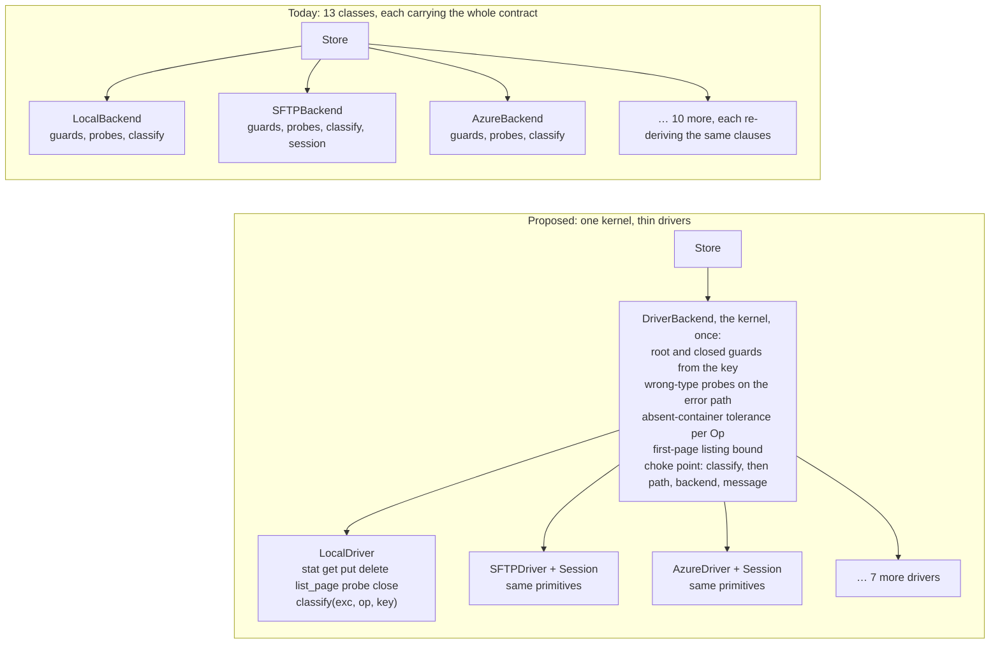
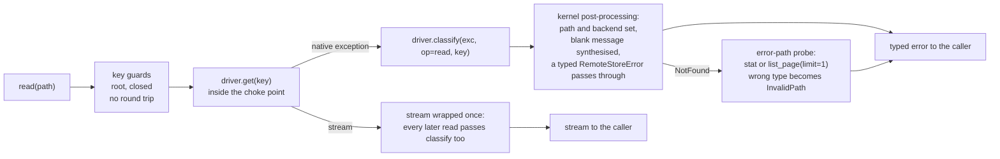

# RFC-0017: One contract kernel over thin drivers

## Status

Draft, decided. Filed from [audit-021](../audits/audit-021-contract-placement.md) at
the user's direction. BK-387 carried D8 step 1: Open Questions 1, 4, 6 and 7
are answered below, and the design is recorded in
[ADR-0042](../adrs/0042-contract-kernel-over-thin-drivers.md), **Proposed**.
The maintainer's condition is that the ADR and this RFC become Accepted
together, in the PR that lands the first backend on this design (D3 step 1),
not on the answers alone. The lifecycle, and where each amendment lands, are
in D8 and § Impact. BK-389's planning PR answered Open Questions 2 and 3,
deferred 5 to D3 step 3 with the shape step 1 keeps open, added the close
posture to D1 and key validation to D2, and split step 1 into a kernel PR (BK-389) and a Memory PR
(BK-394), the second accepting; BK-389's dossier § Decisions carries them.

**Date:** 2026-09-28. Every figure below is pinned to `8fa22d6` and is either
quoted from audit-021 with its derivation, or names its command here. The tree
moves on every merge: re-run rather than quote.

## Summary

This RFC proposes that the `Backend` surface be implemented **once**, in a
concrete `DriverBackend(Backend)` kernel over a per-backend `Driver` of
fourteen required wire primitives and nine optional ones, with error mapping
at a single choke point that invokes the driver's operation-scoped
`classify(exc, op, key)` on every call, listing page and stream and
guarantees the error's `path`, `backend` and a non-empty message.

Today every backend class implements the surface by hand, 10 sync classes × 21
I/O methods plus 3 async classes × 19, and re-derives the contract's
cross-cutting clauses inside each method. Audit-021 attributes 45 of the 71
user-audience defects of the last six releases (63%) to rules stated once and
re-implemented per class; measured against this design by the rules in § What
each cluster-A bug becomes, the kernel owns 10 of those outright (14% of the
71), 6 are split with the driver, 8 stay in the driver, 6 waited on a
decision at filing (four since decided, three under Open Question 4 and one
under Open Question 2; one deferred to D3 step 3 under Open Question 5),
2 disappear with a retired class, and 13 belong to D5's session layer. Counted
by clause rather than by item, the 45 sit on 14 clauses (11 in cluster A, 3 in
B); the audit derives no clause count for the other 26, so the 14 has no
share. The 63% is the audit's diagnosis of the placement; the 14% is what this
kernel alone removes, and the rest of the proposal (the session layer, one
driver per service, the wire-signal question) is sized against the remainder.
`Store`, `Registry`, the error hierarchy and capabilities keep their
interfaces; the conformance suite is the migration's oracle, with the cells
that change enumerated before the first migration.

## Motivation

### The bug population is the contract, re-implemented

Audit-021 § H-1 carries the register and the figures; the two that decide the
design are these. **The same clause is fixed N times:** 14 of cluster A's 35
entries name two or more classes, and BUG-259 changed eight classes on two
halves of one rule that binds eleven. **The fix lands per method, so it is
missed per method:** BUG-249 was three listing methods on one class left
unwrapped "against fifteen methods that do wrap"; BUG-280 is the same shape on
`LocalBackend`; BUG-293 is twelve `except` arms across the two Azure classes;
BUG-276 is seven sites in five files.

The eight shared guard helpers are called on 164 lines across 10 files and
wrapped per class 22 times (audit-021 commands (e) and (g)), the source
carries 395 `except` handlers, and `Store` catches nothing: the never-leak
invariant of BE-021 is asserted inside each of the 13 classes and zero times
at the boundary every call crosses. BE-021 itself is 497 lines of prose
(spec 003 lines 676 to 1172 inclusive) stating what one function should do.

### The remedies already tried were tests, static checks and spec text

The bug-prevention research (2026-04-03) and the contract-completeness research
(2026-04-05) diagnosed the same cross-product. The first prescribed seven
deliverables, of which six exist (`_safe_wrap`, the property-based tests, ruff
`BLE`, the extended conformance cells, the `ResourceWarning` sites; audit-021
§ H-1 names each one's location) and one, an AST check over broad `except`
arms in the backends, was deferred and never built. The second prescribed
tightened clauses, and BE-021 reached 497 lines; the conformance suite reached
323 test functions. Cluster A still produced 35 defects in six releases, 13 of
them closed in v0.31.0 alone (audit-021 § Summary carries the per-release
series and its review-chain confound). A test fails only on the cell it covers, and
the contract-completeness research's own estimate of the product
(`research-backend-contract-completeness.md` § 3) was ~1,890 cells at 7
backends and 18 methods, ~3,510 by the same formula at 13 classes, treating
the three async twins as classes. That scaling counts the backend axis only;
the driver × wire half of the product stays with the per-driver suites
(§ Impact, Risks). Removing the backend axis from the kernel's half is the
change that alters the count; covering the product does not. The unbuilt
static check is taken up under § Alternatives.

### The repo is already half way there

`_S3Base` (RFC-0005, BK-011), `_flat_ns.py` (ID-211; 495 lines of guards
applied by injection), `_safe_wrap` (BUG-159), `_ErrorMappingStream(mapper=...)`
and `AsyncBackendSyncAdapter` (ADR-0025) each share one piece of the contract
across some classes. None reaches all 13 and none owns the method bodies.
RFC-0005 is the direct antecedent: it extracted `_S3Base` as deduplication and
stopped at the S3 family. This RFC finishes that move rather than starting a
new one.

## Proposal

### The shape in one picture

Today each class is the whole contract; the proposal puts the contract in one
kernel and leaves each class a driver of wire primitives plus one classifier.



The kernel is generic over the driver, so the fourteen primitives and the
classifier are all a new backend writes, and every clause in the kernel box
is applied to it without being restated.

### D1. A `Driver` of wire primitives, with capabilities declared, not derived

A driver maps one-to-one onto its wire protocol and carries no path, root,
type, closed or mapping logic. Fourteen required callables and six
attributes (the sixth, `close_is_terminal`, added at BK-389's planning):

```python
class Driver(Protocol):
    name: str
    namespace: Literal["flat", "hierarchical"]
    parents: Literal["none", "implicit", "explicit"]  # HTTP none; Graph, Azure HNS implicit; Local, SFTP explicit
    capabilities: CapabilitySet   # declared by the driver, as a backend's CAPABILITIES ClassVar is today (SEEK-001's shape); the kernel adds none
    put_is_atomic: bool           # S3, SQL, flat Azure True (write_atomic is put); Local, SFTP False
    close_is_terminal: bool       # BE-020's posture; the kernel's closed guard runs only when True (Memory False)

    def stat(self, key: str) -> Entry | None: ...        # file OR folder, kind on the Entry; None if absent
    def get(self, key: str) -> BinaryIO: ...
    def put(self, key: str, content, *, overwrite: bool, metadata) -> WriteResult: ...
    def delete(self, key: str) -> None: ...
    def list_page(self, prefix: str, *, delimiter: str | None, cursor, limit: int | None) -> Page: ...
    def probe(self) -> None: ...                         # health; must touch the container
    def close(self) -> None: ...

    def classify(self, exc: Exception, *, op: Op, key: str) -> RemoteStoreError: ...
    def container_absent(self, exc: BaseException, *, op: Op) -> bool: ...
    def connection_dead(self, exc: BaseException) -> bool: ...

    # interop, forwarded by the kernel (BE-022, BE-023, BE-025, resolve); since BK-389's
    # planning, native_path and resolve receive the canonical key (BK-389 decision 6)
    def unwrap(self, type_hint: type[T]) -> T: ...
    def native_path(self, key: str) -> str: ...
    def to_key(self, native_path: str) -> str: ...
    def resolve(self, key: str) -> ResolutionPlan: ...
```

Nine optional protocols, each a separate `runtime_checkable` `Protocol`
checked once at kernel construction (a `typing.Protocol` cannot express an
optional member, so presence is a protocol, not a method):

| Protocol | Member | What the kernel does with it, and without it |
|---|---|---|
| `SupportsRangeRead` | `get_range(key, offset, length)` | serves `read_seekable` by ranged reads (Azure's `_AzureRangeReader`, the boto3 lane's `_S3RangeReader`); without it, spools over `get` as the ABC default does today |
| `SupportsOpenWrite` | `open_write(key, *, metadata) -> WriteHandle` with `commit()` and `abort()` | serves `open_atomic` on a wire-side temporary (S3 multipart Complete/Abort, Local and SFTP temp files); without it, spools locally and hands the spool to `write_atomic` at exit, which is ADR-0025's synthesis (`_SpoolAndFlush`) and what `AzureBackend` does today in both namespaces: a plain upload on flat, where `put_is_atomic`, and temp upload plus `rename_file` on HNS |
| `SupportsAtomicMove` | `move(src, dst, *, overwrite)` | forwarded whole, so the kernel never sequences the checks of an atomic move (SQLBlob's single transaction, Memory's single lock); one of the two ways to back a declared `ATOMIC_MOVE` |
| `SupportsRename` | `rename(src, dst, *, replace: bool)` | `move` for drivers without `SupportsAtomicMove`: `replace=True` where the wire's rename replaces atomically (Local's `os.rename` within one root, which is why `LocalBackend` declares `ATOMIC_MOVE` today, `_local.py` lines 668 to 670), `replace=False` where it cannot, in which case the kernel runs the displace-and-restore fallback SFTP carries today, and only there |
| `SupportsCopy` | `copy(src, dst)` | `copy`, and `move` as copy-then-delete when neither of the two above exists |
| `SupportsDeleteTree` | `delete_tree(prefix)` | `delete_folder(recursive=True)` in one wire call (Graph's single DELETE, Azure HNS `delete_directory`, SQL's one transactional `DELETE … LIKE`, S3 `DeleteObjects` in batches of 1000); without it, list then delete |
| `SupportsEnsureParents` | `ensure_parents(key)` | called before `put` when `parents == "explicit"`; SFTP's stat walk and Local's `mkdir -p` are their implementations. Never called for `implicit` (Graph, GR-039: no explicit `mkdir`; Azure HNS) or `none` |
| `SupportsFolderStats` | `folder_stats(prefix) -> (count, size, latest)` | `get_folder_info` push-down (SQL's aggregate query); without it, the kernel aggregates a listing |
| `SupportsGlob` | `glob(pattern)` | native `GLOB`; without it the driver must not declare `GLOB` |

Two more attributes the stream wrapper reads per driver, because
`_ErrorMappingStream`'s caught set is per construction site today:
`stream_catch: tuple[type[BaseException], ...]` (SFTP's paramiko shapes) and
`size_probe` (the `SEEK_END` resolver BK-357 added).

**Capabilities are the driver's declaration, and the kernel validates rather
than derives.** Deriving a flag from a member's presence contradicts the
capabilities as defined: `SEEKABLE_READ` means "`read()` always returns a
seekable stream" (spec 006 SIO-008; `_capabilities.py` L75), which Memory and
the SQL backends hold with no range primitive and Azure lacks with one; and
CAP-007 (spec 003 line 47) says a backend that implements move as
copy-then-delete does not declare `ATOMIC_MOVE`, and `sftp` omits it
(`_SFTP_CAPABILITIES`, `_sftp.py` line 48) although it has a rename.
So the driver declares its `CapabilitySet` exactly as a backend does today,
and at construction the kernel checks consistency in one direction only:
`ATOMIC_MOVE` requires `SupportsAtomicMove` or `SupportsRename` with
`replace=True` (Local's case); `ATOMIC_WRITE` requires
`put_is_atomic`, `SupportsOpenWrite`, or `SupportsRename` with `replace=True`
for a temp-and-promote; `GLOB` requires `SupportsGlob`; `COPY` requires
`SupportsCopy`. The kernel synthesises `move`, `open_atomic`, `read_seekable`
and `delete_folder` from what is present and never adds a flag. A driver that
omits `get_range` or `open_write` therefore keeps its declared capabilities
and loses a data path; § Impact names where that lands.

`Entry` (key, kind `file | folder`, size, modified, etag, metadata), `Page`
(entries, common prefixes, next cursor) and `WriteHandle` are small records.
`Op` is an enum of the public operations plus the kernel's internal scopes
(`probe`, `identity`, `monitor`), so a driver can classify by what asked:
today every classifier already takes `path` (ERR-001), Graph's
`classify_graph_error` takes a `scope` that decides whether a `404` is an
absent item or an absent drive
([ADR-0038](../adrs/0038-absent-container-outranks-drive-identity.md),
BK-266), and Azure routes listings and file operations through different
context managers. A `classify(exc)` with no scope could not reproduce either
and would re-open BUG-248; the scope is therefore part of the primitive, and
the driver, not the kernel, decides what an identity-scope failure means.

**`classify` may perform I/O, and the kernel says where it runs.** SQL's
dropped-table detection is an inspector round trip (`_sqlalchemy.py` line
798) and Local on Windows maps `PermissionError` through `is_dir()`
(`_local.py` lines 215 and 244). SFTP's `_map_exception` is pure over the
exception, its two connection predicates being static methods over `exc`;
the I/O BUG-274 paid was the classification path around it re-evaluating
the lazy `_sftp` accessor. For a remote driver the kernel invokes `classify`
inside `Session.run` (D5), so a classifier that does touch the connection
cannot re-enter the reconnecting accessor
(BUG-274's and BUG-278's shape); for Local and Memory, which have no
`Session`, it runs in the choke point with no retry, per ADR-0011's per-backend retry, which stays the driver's.
`ReadOnlyHttpBackend`'s driver raises an `HttpStatusError(status)` from its
primitives, since its failures are status codes rather than exceptions.

### D2. One kernel is a `Backend`

`DriverBackend(Backend)` implements the 21 methods audit-021 command (a)
names (`close` and `check_health` among them) over a driver and forwards the
other 6 public members (`name`, `capabilities`, `unwrap`, `native_path`,
`to_key`, `resolve`). `Backend` has 27 public `def`s, lines 57 to 571 of
`_backend.py` by `rg -n '^    def [a-z]' _backend.py`, every match inside
`class Backend` (re-run when BK-380 deleted the `_SeekableSpool` helper that
was a 28th match above it). It owns, once:

- key validation and normalisation (added at BK-389's planning): a key
  starting with `/`, a `..` segment or a null byte is refused with
  `InvalidPath`, and empty and `.` segments are dropped. The rule is spec
  013's MEM-DS-005 table, not `RemotePath`'s; spec 013 states where the two
  differ. It runs after the closed guard and before the root check, which
  then runs on the canonical key: `""` is the root, the wide predicate on
  every side. So a driver only ever sees a canonical key, as D1's driver,
  which "carries no path … logic", requires. It covers every member that
  takes a key: `native_path` and `resolve` too, without the closed guard,
  per BE-020's addressing carve-out. `to_key` is forwarded unchanged, since
  its input is a native path. The member-by-key-class table, with its
  measured Memory column, is BK-389's dossier, decision 6;
- root refusal from the key (BE-029; at filing, both predicates as `_flat_ns`
  now states them; since BK-389's planning, decided on the canonical key,
  which gives the wide predicate on every side, the floor BE-029 sets for
  the write side and a permitted excess elsewhere), and the closed guard where the driver declares
  `close_is_terminal`, in the order spec 003 fixes; these are
  key-level checks and add no round trip;
- the wrong-type probes on the error path (one `stat` and one
  `list_page(limit=1)`, the same probes the classes issue today), the
  absent-container tolerance, and the first-page listing bound (BE-021),
  including its page-not-item rule;
- the file-ancestor pre-check as a kernel option with today's default: the
  opt-in `reject_write_under_file_ancestor` moves from each flat-namespace
  class to the kernel's constructor, default off, and the walk runs in the
  kernel before any `put` when set. Its probe-error policy is BUG-292's,
  decided at BK-387: only a confirmed miss reads as "no ancestor", and any
  other probe error, a transient one included, propagates mapped;
- the `max_depth` reference algorithm, decided once (Open Question 4 names
  BUG-240 as the contradiction to adjudicate before the kernel encodes it);
- `write_atomic` as `put` where `put_is_atomic`, as `open_write` + `commit`
  where that exists, else as `put` to a temp key + `rename(replace=True)`;
  never a PUT + CopyObject + DELETE on a store whose PUT is already atomic
  (S3, SQL, flat Azure today all implement `write_atomic` as plain `write`);
- `move` as D1's table states, so a `SupportsAtomicMove` driver's move is
  never sequenced by the kernel, a `replace=True` rename is one wire call,
  and displace-and-restore runs only for a `replace=False` rename;
- error mapping at a single choke point: every driver call, every `list_page`
  iteration and every stream handed back by `get` or `get_range` passes
  through `driver.classify(exc, op=..., key=...)`; a `RemoteStoreError`
  already typed passes through untouched (BUG-293); and the kernel
  post-processes what comes back, setting `path` and `backend` (ERR-001) and
  synthesising a message from the exception class when what comes back is
  blank (ERR-009). That floor would hold under either arm of BUG-276's
  decision; the arm decided at BK-387 is "synthesise", for which the floor
  is the fix itself;
- the absent-container rule applied per operation scope, not per exception:
  the tolerant answers BE-021 § Reach decides are given only for the
  operations it names, and identity-scope calls (`write`, `probe`, drive-id
  resolution, the copy/move monitor) hand the driver an `Op` it may escalate,
  which is ADR-0038's ruling kept rather than overridden.

One call through the kernel, `read` as the example; every other operation
takes the same path with its own primitive and `Op`:



**What `Backend` is afterwards.** `Backend` stays the abstract contract type
every caller and every test names; the kernel is one concrete subclass.
Subclassing `Backend` directly stays valid and keeps passing the conformance
suite; it is deprecated as the way to add a backend, not removed. The
consequences for the in-tree subclasses that are not among the 13, enumerated
by `rg '^class \w+\(.*\b(Backend|AsyncBackend)\b' src tests examples`: 21
matches, of which 9 are concrete backends (the other 4 of the 13 subclass
`_S3Base` or `_SQLAlchemyBaseBackend`) and these 12 are not. The `^class`
anchor misses five indented subclasses, by the same regex with `^\s+class`:
three fakes that stay as they are (`tests/test_info.py`, a second one in
`tests/ext/test_arrow.py`, a docstring example in
`_async_to_sync_adapter.py`) and two published snippets that § Impact lists
(`MyBackend` in `examples/snippets/homepage.py`, the landing page's example
of adding a backend, and `_ReadOnlyBackend` in the guide's
`partial-capabilities` region). The 12:
`_S3Base` retires with its two lanes (D4); `_SQLAlchemyBaseBackend` becomes
the shared part of the two SQL drivers; `AsyncBackendSyncAdapter(Backend)`
and `SyncBackendAdapter(AsyncBackend)` stay direct subclasses, since each is
the other runtime's face of a backend and not a backend of its own (D6
decided that the sync kernel is generated, so the first does not become it);
`DafnyOracleBackend` stays a direct subclass by design (D7); the fake in
`tests/ext/test_arrow.py`, the two fakes in
`tests/scripts/test_dafny_classorder.py` and the three doubles under
`tests/aio/` stay as they are; `RedisBackend` in
`examples/snippets/custom_backend_guide.py` is rewritten as a driver, and
`scripts/check_custom_backend_guide.py` (BK-320), which gates the guide
against `Backend.__abstractmethods__`, is re-pointed at `Driver`.

### D3. Migration, one step at a time, with the suite as oracle

The kernel lands beside the existing classes. Each step below migrates in its
own PR (a step is one class, or a pair migrated together), green when the
conformance suite passes for its fixtures
with the cell changes enumerated below and no others. Not every class
migrates; the fate of each of the 13 is fixed here so that D3 and D4 cannot
disagree:

| Step | Class | Fate |
|---|---|---|
| 1 | `MemoryBackend`, `AsyncMemoryBackend` | migrate first: the simplest drivers, and the oracle's counterparts (D7) |
| 2 | `S3Boto3Backend` | migrate: the S3 driver, with the D4 promotion list |
| 3 | `SQLBlobBackend`, `SQLQueryBackend` | migrate |
| 4 | `AsyncAzureBackend` | migrate: the Azure driver |
| 5 | `LocalBackend` | migrate |
| 6 | `SFTPBackend` | migrate |
| 7 | `GraphBackend` | migrate |
| 8 | `ReadOnlyHttpBackend` | migrate |
| in 2 | `S3Backend`, `S3PyArrowBackend` | retire, unmigrated, in the step-2 PR behind D8's gate; `_S3Base` goes with them |
| in 4 | `AzureBackend` (sync) | replaced, unmigrated, by the sync driver generated from the step-4 async driver (Open Question 1), in the step-4 PR behind the same gate |

Every remote driver migrates with its `Session` (D5): the protocol lands at
step 2 with the first remote driver, and each later remote step (3, 4, 6, 7
and 8) brings its own.

**The suite is not "unchanged"; the cells that change are these, enumerated
before step 1 and each settled before the step that changes it (Open
Question 4).** Added at BK-389's planning: the kernel's key rule (BK-389
dossier, decision 6) is one more enumerated change, stated once as a table of
member by key class. Each step's PR lists that table's cells where its driver
answers a non-canonical key differently today. Step 1's list, for Memory, is
in BK-394's dossier. No conformance cell reaches those cells, so each is a
direct-backend answer that its step's PR pins with a new cell. AZ-025's blank-message clause and its pinning
test go red with BUG-276's fix under the arm decided at BK-387, synthesise
(its dossier: "Both go red when this lands, by design"); the BUG-240 and
BUG-292 decisions change cells on the classes that
follow the losing reading (decided at BK-387: DEPTH-003 wins, so
`GraphBackend`'s; the catch narrows, so the five flat-namespace `_head_one`
probes'). For folder `modified_at`, the kernel fixes one aggregation at
step 1 (decided at BK-387): the latest known file modification time under
the prefix, recursively, where a file whose time is the unknown sentinel
(`datetime.min` in UTC) is skipped, and a folder with no known time answers
`None`. Read from each `get_folder_info`, that leaves every backend's cell
unchanged but Graph's:

- the latest time, recursively: `MemoryBackend` and `AsyncMemoryBackend`
  (the `latest` loop), `LocalBackend` (`latest_mtime` over `rglob`),
  `SFTPBackend` (`latest_modified`), `AsyncAzureBackend`
  (`latest_modified`), sync `AzureBackend` (the latest `last_modified`, flat
  and HNS, which its generated replacement keeps), `S3Boto3Backend` (the
  maximum `LastModified`) and `SQLBlobBackend` (`MAX(modified_at)`);
- `None`, because no file time is known: `SQLQueryBackend`, whose files
  carry the sentinel (`_models._UNKNOWN_MODIFIED_AT` since BUG-296), and `SQLBlobBackend` over a table with no
  `modified_at` column, whose files carry `datetime.min`;
- no folders: `ReadOnlyHttpBackend`;
- out of scope, being deleted unmigrated at step 2: `S3Backend` and
  `S3PyArrowBackend` (the shared `_s3_base.py` `get_folder_info`);
- the folder item's own `lastModifiedDateTime`: `GraphBackend`, whose cell
  changes at step 7. What step 7 decides is only how Graph meets the rule:
  the changed cell, or a `SupportsFolderStats` push-down computing the same
  value.

And the conformance
registry (`tests/backends/fixtures/registry.py`) registers drivers beside
`Backend` instances, a driver fixture running through the kernel and a
direct-subclass fixture staying runnable as today (`DafnyOracleBackend` is
`[fixture.dafny_oracle]` in `fixtures.toml`), which is what D2's
"keep passing the conformance suite" and D7's oracle rest on. The capability
enum (CAP-001), the quality-flag rule (CAP-007) and
the declaration clause (SEEK-001) do not change, because D1 leaves
capabilities declared. The three retiring classes are never migrated: each is deleted in
the PR that lands its replacement (D8 step 3), so no release ships both, and
they are outside D8's measurement. Nothing above `Backend` changes at any
step.

### D4. One driver per service

- **S3.** Promote the parked `S3Boto3Backend` (ID-202) as the S3 driver: it
  is standalone, boto3-only, and the lane spec 003 already cites as "the shape
  a fix takes" for the first-page bound. It is today wheel-excluded,
  unregistered and conformance-tested on moto only, so promotion is a list,
  not a rename, and every item is a precondition of the retirement gate (D8
  step 3, condition (c)):
  ID-202 § 4a's Ship items (an `S3B-*` spec block replacing the borrowed
  `S3-015/016/018` marks; a SEEK-004 amendment dropping the lane from the
  passthrough list and an `S3B-*` axiom for its `read_seekable`; the
  write-over-prefix divergence from the s3fs lane stated or closed;
  multipart copy for objects over 5 GB, since `copy_object` is single-part);
  ID-202 § 6's wiring (the `s3-boto3` extra, `_registry.py`, `_info`,
  `__all__`, `FEATURES.md`, a guide, a CHANGELOG entry; ID-202's async
  variant is not on the list, since no async S3 class exists today and async
  callers keep `SyncBackendAdapter`'s auto-wrap, decided at BK-387);
  option parity for what the s3fs lane forwards today through
  `client_options` (`anon`, `requester_pays`, `s3_additional_kwargs` for SSE,
  `profile`), which the boto3 lane does not honour; a MinIO or live lane
  beside moto; and continuity of `name == "s3"` for the registered type, so
  `error.backend` and the observe labels do not change. What does change and
  is stated: `unwrap(s3fs.S3FileSystem)` becomes `unwrap` of the boto3
  client, and `ext.arrow`'s Tier-1 native PyArrow probe, which fires only on
  `S3PyArrowBackend` (`unwrap(pyarrow.fs.FileSystem)`, `_s3_pyarrow.py` line
  536; `S3Backend.unwrap` answers `s3fs.S3FileSystem` alone, `_s3.py` line
  545), no longer fires on S3 once that lane retires, so `ext/` is not
  unchanged (§ Impact). The kernel subsumes the
  `_S3Base` refactor ID-202 § 4 names, rather than being it.
  `S3PyArrowBackend` exists for data-path throughput (its docstring: "Uses
  PyArrow's C++ S3 filesystem for data-path operations (higher throughput)";
  RFC-0003 tuned that path), so retiring it is a performance change measured
  under § Impact before the gate opens.
- **Azure.** Keep one driver, the async one. Sync callers reach it through a
  sync driver generated from it by the same `unasync` step that generates the
  sync kernel (Open Question 1), so the hand-written sync class is replaced by
  the generated one and keeps its behaviour, its ranged `read_seekable`
  included. The rejected alternative was the adapter route: sync Azure callers
  moved to `AsyncBackendSyncAdapter`, losing what § Impact lists under
  Performance, and `type="azure"` served by a registered callable wrapping the
  async driver, which would have widened `register_backend`'s parameter from
  `type[Backend]` (`_registry.py` line 19) to `Callable[..., Backend]`. The
  chosen route needs neither.

Hand-written concrete classes go from 13 to 10 (D3's migrating rows), and
the hand-written driver surface to 10 drivers × 14 required primitives (plus
the optional protocols each implements) instead of 10 classes × 21 methods
plus 3 × 19. The sync Azure driver generated from the async one (Open
Question 1) is an eleventh driver: generated, except its stream-returning
primitives (D6).

### D5. A session layer for every remote driver

A `Session` owns connect, the connect-retry budget, liveness, dead-client
invalidation and one `run(op)` entry, and every remote driver has one (decided
at BK-387's close, widening the SFTP-and-Graph scope this section was filed
with). Local and Memory hold no connection and have none:

```python
class Session(Protocol):
    def run(self, op: Callable[[Client], R], *, key: str) -> R: ...  # connects if needed, once per budget
    def invalidate(self, exc: BaseException) -> None: ...            # drop the client; next run reconnects
    def connect_context(self) -> ConnectContext | None: ...          # what the last connect saw: host, errno, phase
```

An operation is then a function of a live client and cannot re-enter the
budget (BUG-274, 278); the kernel evaluates nothing lazily outside `run`, so
`unwrap` of a session driver's client goes through it (BUG-279); and
`classify` receives `connect_context()`, so a connect-time `EPERM` can be told
from a server denial (BUG-273, 265). The budget it owns is the **connect**
budget; per-operation retry stays the driver's, native, as ADR-0011 decides,
and ADR-0011 is amended to state that split rather than superseded; a wire
whose SDK does not separate connect from operation has no connect budget to
move. What a `Session` holds follows the wire:

- SFTP: the connection, its connect budget, liveness and invalidation;
- Graph: the token (single-flight refresh) and the copy/move monitor;
- the SQL drivers: the engine, whose pool sits inside the `Session`, which
  invalidates a dead connection. A dropped table is still an absent container
  that `container_absent` answers (BE-021, `_sqlalchemy.py`'s inspector
  check), not a dead session and not `BackendUnavailable`;
- S3 and Azure: the SDK client and its credential, the SDK's own pool and
  retry inside it;
- HTTP: its pluggable `HttpTransport` (httpx, requests or urllib, in that
  order unless one is forced, per HTTP-TR-002).

D5 reaches 13 of the 71, all on SFTP: cluster B's 10 plus BUG-279, 265 and
273 (audit-021's appendix rows tag each `sftp`). The other drivers'
`Session`s move no measured defect; they give
every remote driver the same lifecycle entry, so `unwrap`, `close` and
connect-time classification have one path.

### D6. Sync and async

The kernel is one more sync/async pair, and the `Driver` protocol has an
`AsyncDriver` mirror for the three async classes D3 migrates. Two options, to
be decided before D3 starts:

1. Write the kernel once in async, `AsyncDriverBackend(AsyncBackend)` over
   `AsyncDriver`, and generate the sync twin `DriverBackend(Backend)` with
   `unasync` (the urllib3 and httpx approach). A sync caller of a driver that
   exists only in async reaches it through `AsyncBackendSyncAdapter` over the
   async kernel, which is what D4's adapter route means and why that route
   exists only under this option: the adapter takes an `AsyncBackend`
   (`_async_to_sync_adapter.py` line 74), and the async kernel is the one
   D3 leaves.
2. Write the kernel sync only, `DriverBackend(Backend)` over `Driver`, with
   a per-primitive thread hop into the three `AsyncDriver`s (the hop
   `AsyncBackendSyncAdapter` makes per operation today, moved to the driver
   boundary), and serve the async surface spec 029 keeps through
   `SyncBackendAdapter(AsyncBackend)` over the sync kernel. Async-native
   drivers then pay two hops on the async surface and are no longer
   first-class, and D4's adapter route is unavailable, so sync Azure
   callers under this option get the generated-driver reading or the
   hand-written class stays.

The first keeps async-native drivers first-class and is the only reading
under which D4's adapter route exists; the second is less machinery at the
cost of the async surface. **Decided: the first** (Open Question 1), with the
generation reaching the Azure driver as well as the kernel, so D4's adapter
route is not taken. `unasync` generates only what the two surfaces share. The
sync surface has `read_seekable` and `open_atomic`, which `AsyncBackend` does
not, and its `read` returns `BinaryIO` where the async one yields an
`AsyncIterator[bytes]`. So a small hand-written sync layer supplies those for
the kernel, over `get_range`, `open_write` and `get`. The generated Azure
driver has the same gap one level down: its stream-returning primitives,
`get` and `get_range`, return `BinaryIO` where the async driver streams an
iterator, so they are hand-written too. The generated parts stay edit-free
under a drift check (decided at BK-387's close, after review showed
generation alone cannot produce them).

### D7. What the formal layer covers, and where the oracle stays

`sdd/formal/BackendContract.dfy` states and verifies the precondition and
type-mismatch clauses (BE-004 to BE-006, BE-008 and BE-012 to BE-019;
BE-021's canonical rows, CAP-004, the `WR-*` write-result clauses,
DEPTH-003's inclusive `max_depth` filter and SIO-008's seekability flag: the
Dafny-tagged IDs `check_formal_trace.py` lists, and by `rg -n '@spec BE-0'
sdd/formal` BE-007, 009, 010 and 011 carry no tag, so `read_bytes`,
intermediate directories and `write_atomic` are outside the model),
`DepthCounting.dfy` the `max_depth` algorithm (DEPTH-001), and
`ResourceSafety.dfy` acquire-then-wrap (SIO-001); the file per ID is where
its `@spec` tag sits, by `rg -n '@spec (DEPTH|SIO)' sdd/formal`. It does **not**
model the root rule (BE-029), the close posture (BE-020), the error
attributes and messages (ERR-*), listing pages, or the absent container:
spec 003 (line 548) records that the model "models the store as a map that
always exists, so the absent-container case has no representation" and those
answers are "pinned in Python only". The kernel is written against the
verified clauses where they exist, and the bound that gives is narrower than
a reader of "verified reference" would take it to be: the clauses behind most
kernel-owned items in the split below are the ones outside the model.

**Since BK-388** the model covers the root rule, the close posture and the
absent container (`sdd/formal/README.md` gaps 9 to 11), and the spec 003
sentence quoted above now says where the absent container is modelled. The
error attributes, messages, listing pages and the never-leak invariant on
listings behind BUG-249 and 280 stay outside it. The paragraph above, and
this section's figures below (the line counts, "modelled today", and the
twin-parity member counts), describe the model as it stood when the RFC was
filed; `sdd/formal/README.md` describes it now.

`DafnyOracleBackend` stays a direct `Backend` subclass and is never migrated.
It is not diffed against the kernel: `sdd/formal/README.md` (T) says "running
the oracle as a peer backend to diff against would only test the oracle
twice", because the oracle's job is to certify that each conformance cell
demands nothing the verified contract does not. The kernel over the Memory
driver therefore runs the suite the oracle has certified, which is why Memory
migrates at D3 step 1, and no peer diff is a criterion anywhere in this RFC.
The Dafny `MemoryBackend` is a refinement of the Dafny contract, not of the
Python class, so there is no refinement target to move.

**Extend the model to the clauses it lacks; do not retarget it at the
kernel.** The formal layer is 3,826 lines across four files (`wc -l
sdd/formal/*.dfy`): the contract is 1,242 lines, and its `MemoryBackend`
refinement alone is 1,885. Retargeting that refinement at
"kernel over an abstract driver" would mean modelling wire failures and
operation scopes as nondeterministic oracles, which is where the model would
grow fastest and prove least: which paramiko shape means the connection died,
or whether a Graph `404` is item- or identity-scoped, is exactly what no
proof reaches, and under D1 it stays in the driver. What is worth extending
is the set of clauses the model does not have, because that is where the
kernel-owned items sit: of the ten under R1 in § What each cluster-A bug
becomes, eight breach clauses the model omits (the root rule for BUG-259,
247, 254, 260; the absent container for 246, 243; the never-leak invariant on
listings for 249, 280), and only BK-324's wrong-type rows and BK-301's
self-op are modelled today. Under the kernel each of those clauses is
implemented once, which is the first time a postcondition for them would have
a single implementation to hold to.

| Clause | Model change | Effort | Recommendation |
|---|---|---|---|
| Root rule, BE-029: which spellings address the root, decided from the key | a pure predicate over the key, plus preconditions on the write-shaped operations (landed as postconditions; see Open Question 7) | S | extend; the clause with the most items and the cheapest proof, and the verified reference ID-251's `./` decision lacks |
| Close posture, BE-020 | a `closed` flag and a postcondition per operation | S | extend |
| Absent container, BE-021 § Reach | the store state becomes optional and most postconditions gain a branch; the refinement follows (landed as a `containerPresent` flag that `Valid()` ties to an empty store; see Open Question 7) | M | extend; it also gives BK-345 and, through the seeding hook BK-345 consumes, ID-244 the verified reference they lack |
| First-page listing bound | pagination in the model | L | do not; the fake-driver test pins it more cheaply |
| `write_atomic`, BE-010 and BE-011, which D2 makes kernel-owned over `put_is_atomic`, `open_write` and `rename` | a `WriteAtomic` method whose postcondition equals `write`'s, plus a two-state atomicity property over a wire the model does not have | M | do not; atomicity is a property of the driver's wire or of the temp-and-promote sequence, and § Testing pins the synthesis against the fake driver |
| Error attributes and messages, ERR-* | strings | — | do not |

The three extensions land before kernel code, in their own item ahead of D3
step 1 (Open Question 7), because the
kernel encodes one answer per clause and a Dafny postcondition is the
sharpest statement of that answer; written after the kernel they would only
ratify whatever it did. Two practicalities: `verify-formal` runs in CI only
when `sdd/formal` or `sdd/specs` change (`ci.yml`'s `FORMAL_PAT`) and is a
required job, and `check_dafny_twin_parity.py`, which holds the two models'
shared members in lockstep (its output at `8fa22d6`: "17 member(s) in
lockstep, 2 declared divergence(s)", the 19 its own comment counts per
class), needs the new members added on both sides; re-run at `0bf7fe6`, the
output is unchanged. Open Question 7 accepted this recommendation.

### D8. Lifecycle: accept the design, gate the deletions

`CONTRIBUTING.md` § Spec-First Workflow runs Propose, Accept, Implement, in
that order, and an RFC that deprecates and deletes classes before it is
accepted inverts it. Acceptance here rides with the PR that lands the first
backend on the design (step 2 below: BK-394, the second of step 1's two PRs,
after BK-389's private kernel), which is additive; no class is deleted before
it. So:

1. **Decide and propose.** Open Questions 1, 4, 6 and 7 are answered and the
   design, D1, D2 and D4 to D7 plus those answers, is recorded as a Proposed
   ADR ([ADR-0042](../adrs/0042-contract-kernel-over-thin-drivers.md)). D3,
   the migration order, is process and stays here. OQ7 is in the list because
   D7's extensions land before kernel code. Done by BK-387.
2. **Implement** D3 in order. Step 1 runs under the Proposed ADR as two PRs,
   the kernel, private (BK-389), then the Memory drivers (BK-394), both merged
   after the v0.33.0 tag. The second, the first backend on the new design,
   **accepts** ADR-0042 and this RFC:
   the design is accepted once it has carried one backend through the suite,
   not on the answers alone. Each migration PR is gated by the conformance
   suite with the enumerated cell changes and by the per-driver suite.
3. **Retire** in the PR that lands the replacement, not on a date or a
   release count: the retiring class is deleted in the same PR that registers
   its replacement under the same type string, once (a) the replacement
   passes the conformance suite with D3's enumerated cell changes and its
   per-driver suite, (b) the throughput and seekable-read benchmarks
   (`benchmarks/test_throughput.py`, `test_seekable.py`,
   `bench_pyarrow_tier1.py`, `bench_azure_pyarrow.py`) show it within the
   acceptance band set once at D8 step 1,
   [`benchmarks/results/acceptance-band.md`](../../benchmarks/results/acceptance-band.md),
   and (c) for a class D4
   retires or replaces unmigrated, every item of D4's promotion list for its
   replacement is complete: the S3 list D4 states, in full and not restated
   here, and for Azure the generated sync driver registered under
   `type="azure"` with the hand-written class's public surface, its class
   name excepted: whether the name is kept is the step-4 decision § Impact,
   Backwards compatibility, names, and (c) holds either way. The suite
   and the benchmarks cover none of the parity items, which is why (c) is a
   separate condition. The repo's policy
   applies unchanged (`docs-src/reference/migration.md`: "Pre-v1: removed
   without a deprecation cycle"): the class is gone in the next release, the
   migration guide names the replacement type string, and rollback is a
   revert of that PR.
4. **Measure** after the last D3 step: a re-audit by audit-021's method over
   the items filed since D8 step 2 began, at D3 step 1 (Memory), classified
   by a reviewer other than
   the implementer. A kernel-owned item found there reopens a `BK-` item to
   decide whether the kernel or the driver is at fault; the audit is the
   RFC's success measurement, not a gate on any deletion.

### What each cluster-A bug becomes

D1 keeps `classify` inside each driver, so the kernel moves where the
classifier is *invoked* and what the kernel does with its result; it does not
move what the classifier *maps*. The 35 cluster-A items are assigned by the
rules below, one rule per row, each item's reason stated; the assignment is a
by-hand reading of the register entries and is disputable item by item.

| Rule | Items | Total |
|---|---|---|
| **R1 kernel-owned**: the defect is a missed invocation of a rule the kernel applies once from the key or at the choke point, on a class that migrates | BUG-254 (root probes on an absent container), 259 (root write guard), 247 (deleted root read as escape), 246 (probes raising on an absent container), 243 (`missing_ok` against an absent container), BK-324 (root, wrong-type, depth), BK-301 (self-op normalisation), BUG-249 (unwrapped listings), 280 (unwrapped listings), 260 (`./` root spelling) | 10 |
| **R2 removed by retirement**: only on the s3fs lanes, which D3 retires unmigrated | BUG-255 (mid-listing 404 swallowed on the s3fs lanes), 242 (403 read as absence on the s3fs lanes) | 2 |
| **R3 split**: the invocation or the guarantee is the kernel's, the verdict or content is the driver's | BUG-264 (message guarantee kernel; arm content driver), BK-358 (stream catch set kernel via `stream_catch`; `BackendUnavailable` verdict driver), BK-359 (message and log record kernel; stall detection driver), BK-266 (self-op copy and the auth leak kernel; probe scope driver), BK-298 (use-after-close kernel; credential ownership driver), BUG-248 (BE-021 § Reach applied per `Op` by the kernel; the identity-scope verdict the driver's, per ADR-0038) | 6 |
| **R4 driver-kept**: classifier content, probe content or resource logic | BUG-275 (errno arm), BK-316 (non-OpenSSH shapes), BUG-231 (a probe that touched nothing; `probe()` is now required but what it touches is the driver's), 222 (429/5xx/401 rows), BK-263 (credential in a message), BK-306 (session release on close), BUG-256 (what `probe()` touches), 253 (Graph's session-create 404 under a file ancestor, with `parents == "implicit"`) | 8 |
| **R5 needs a decision first**: at filing, the item carried an open decision in `BACKLOG.md` or depended on an open question here. BUG-240, 292 and 276 were decided at BK-387 (Open Question 4) and keep this row as their at-filing assignment | BUG-240 (OQ4; decided: DEPTH-003), 292 (BE-008's probe-error choice; decided: narrow the catch), 276 (synthesise or classify at the five base-class sites, decided: synthesise; the kernel's ERR-009 floor holds under both, so the decision is the driver's arm content, as for BUG-264 in R3), 293 (which arms receive a typed error), 245 (construction; OQ5, deferred at BK-389's planning to step 3), 257 (page boundary; OQ2, decided at BK-389's planning) | 6 |
| **R6 session (D5)** | BUG-279 (`unwrap` outside the mapper), 265 (connect-time shapes), 273 (connect-time context) | 3 |

Ten of 35 is what the kernel alone removes; with D5's three and the two
retirements, 15. The eight R4 items are the argument for the wire-signal
alternative under § Alternatives; Open Question 6 asked whether to take it,
and its answer keeps `classify`.

## Alternatives Considered

- **More conformance cells, tighter spec text.** Tried (§ Motivation). Covers
  the product one cell at a time; the product stays.
- **The deferred static check** (`check_error_handling.py`, deliverable 6 of
  the bug-prevention research): an AST pass flagging a broad `except` arm
  that returns silently without inspecting `errno`, type or status. Cheap,
  and worth building whether or not this RFC is accepted, since cluster A's
  broad-arm members (BUG-293, 276, 275, 264, 222, 242, BK-316) are its
  target. It does not reach the invocation shape, which audit-021's H-1
  clause table puts at 21 of the 35 (20 once BUG-242, on both lists, is
  taken out), because those are absences rather than arms. Complementary,
  not a substitute.
- **RFC-0005's route, extended.** Deduplicate per family (`_S3Base` was its
  result). Removes copies within a family and leaves the per-class method
  bodies, so a clause is still applied per family rather than once; the
  prior art this RFC generalises.
- **A normalised wire-signal primitive instead of `classify`.** The driver
  returns `WireSignal(status, errno, service_code, message, connection_dead)`
  for a native exception, and the kernel owns BE-021's row table and maps it.
  Of the eight R4 items it reaches the mapping-content ones, BUG-222, 275,
  BK-316 and arguably BK-263, and not the probe or resource ones (BUG-231,
  256, 253, BK-306). It costs a primitive that must express every wire's
  vocabulary at once (S3 service codes, Azure `HttpResponseError` codes,
  Graph's scoped `404`, paramiko's shapes with no errno, SQLAlchemy dialect
  errors), which is the part of BE-021 that grew per backend for a reason.
  Not chosen; Open Question 6's answer keeps `classify`.
- **A last-resort mapper at the `Store` boundary only.** Closes the never-leak
  breaches on operations (BUG-249, 280, BK-358) and nothing else: it cannot
  reach construction (BUG-245) or a lazy client evaluated outside the mapper
  (BUG-279), and root, absent-container, wrong-type and the listing bound are
  semantics, not mapping, and would still be implemented 13 times. Cheap, and
  worth doing first as a stop-gap if D3 is delayed; not a substitute.
- **Mixins per clause.** Keeps the method bodies per class and adds a
  resolution-order puzzle; the 164 guard call lines become as many `super()`
  calls. Rejected.
- **Adopt fsspec's `AbstractFileSystem` as the kernel.** ADR-0003 already
  decided fsspec is an implementation detail, and its derived-method layer
  re-raises `FileNotFoundError` rather than a typed hierarchy, so the mapping
  work would remain. The *shape* is the precedent, not the library:
  `gocloud.dev/blob` (a ~12-method `driver.Bucket`, a portable `blob.Bucket`
  that wraps every call and maps every error through `ErrorCode` at one
  boundary) and Rust `object_store` (a ten-method trait, everything else
  derived) are closer to D1/D2.

## Impact

- **Public API:** `Store`, the error hierarchy and capabilities unchanged in
  interface. `Backend` remains the abstract contract type; `DriverBackend` and
  `AsyncDriverBackend` are the kernel's two runtimes (Open Question 1). New
  public names: `Driver`, `AsyncDriver`, the nine `Supports*` protocols and
  their async mirrors, `DriverBackend`, `AsyncDriverBackend`, `Entry`,
  `Page`, `WriteHandle`, `Op`, `Session`. `ext.arrow` loses its
  Tier-1 native probe on S3 once the PyArrow lane, `S3PyArrowBackend`,
  retires (D4); the s3fs lane never served that probe.
- **Backwards compatibility:** additive for existing `Backend` subclasses,
  which keep working and keep passing conformance; the custom-backend guide,
  its check script and the conformance registry move to drivers, and direct
  subclassing is deprecated as the documented route, so the migration guide
  owes a section for backend authors. Breaking for users of `S3Backend` and
  `S3PyArrowBackend` as class names in the release that carries D3 step 2,
  and for sync `AzureBackend` as a class name at step 4 unless its generated
  replacement keeps the name, and for
  `unwrap(s3fs.S3FileSystem)` callers at step 2. `Store` callers see no
  change in interface.
- **Performance:** the kernel issues the same probes the per-backend code
  issues today (one `stat` or one `list_page(limit=1)` on the error path; the
  file-ancestor walk only when opted in; `ensure_parents` only for explicit
  parents), and the S3 driver drops the s3fs layer. Two replacements change
  data paths and are measured under D8's benchmark gate in the PR that
  lands them:
  - `S3PyArrowBackend`: reads move from PyArrow's C++ S3 filesystem to the
    boto3 driver.
  - sync `AzureBackend`: its replacement is generated from the async driver,
    whose `get_range` keeps the ranged `read_seekable`
    (`_AzureRangeReader`, one Range request per read) the class has today;
    `open_atomic` stays the spool-and-upload the kernel synthesises without
    `open_write`, which is what flat and HNS `AzureBackend` do today.

  The rejected adapter route for sync Azure (Open Question 1) is kept here as
  the reason it was rejected. The sync class never declared `SEEKABLE_READ`,
  so what it would have lost is its `read_seekable` override, replaced by the
  adapter's spool; a call from a thread with a running event loop raises
  `RuntimeError`, so sync `Store` over Azure would stop working inside
  notebooks and `pytest-asyncio` tests; `unwrap()` raises
  `CapabilityNotSupported` by default; a caller-supplied sync `credential=`
  is handed to the async SDK unchanged; `error.backend` carries the async
  driver's name; and `type="azure"` needs the wrapping registration D4
  describes.
- **Risks:** a kernel defect is a regression on every migrated class at once.
  BUG-249 reached one class; its kernel equivalent reaches every driver. That
  is the price of applying a rule once, and it is bounded by D3 migrating one
  step per PR behind the suite (a step is one class, or a pair such as the
  Memory or SQL drivers), each PR revertable on its own; the formal
  layer bounds only the clauses it models (D7). The second risk is the fake driver's reach: it exercises
  kernel × failure mode, not driver × wire semantics, so BUG-223's HNS probe,
  BK-316's non-OpenSSH shapes and S3's lack of a rename are driver defects
  the kernel's test cannot see, and the per-driver suites keep them.
- **Testing:** the kernel is tested once against a fake driver that can be
  told to raise any wire shape at any call, covering BE-021's type-mismatch
  roster and its § Reach roster separately, as spec 003 states them, plus the
  never-leak invariant on every operation, page and stream and the
  `write_atomic` and `move` syntheses over each combination of
  `put_is_atomic`, `open_write`, `rename` and `SupportsAtomicMove` the fake
  driver can present; the driver half
  stays with the per-driver suites. BK-345 and ID-244 reduce to driver
  cells (corrected at BK-389's planning: BK-345's kernel half, the
  absent-container answers per `Op`, became fake-driver kernel cells in
  BK-389, and its driver cells start at step 2); ID-251's widened root spellings become fake-driver kernel cells,
  since R1 makes the root rule the kernel's. The conformance suite gates
  every migration with the cell
  changes D3 enumerates.
- **Amendments**, each an obligation this RFC creates. Each lands where it
  becomes true, since a spec or guide describes the code that exists
  (`CLAUDE.md` principle 3). At D8 step 1 (BK-387): the benchmark acceptance
  band,
  [`benchmarks/results/acceptance-band.md`](../../benchmarks/results/acceptance-band.md),
  and [ADR-0042](../adrs/0042-contract-kernel-over-thin-drivers.md),
  Proposed, which carries the four ADR amendments. With D3 step 1's Memory PR
  (BK-394), which accepts that ADR (the kernel PR before it, BK-389, is
  private and amends nothing): specs 003, 005, 029 and 037 below, spec 013 (Memory's,
  as a kernel/driver placement per clause, which the list at filing omitted),
  the kernel half
  of 007 and 022, the Memory drivers' rows of 007 and 022, spec 026's PING-002
  and PING-008, spec 003's BE-017 folder `modified_at` rule, the
  custom-backend guide with its `partial-capabilities`
  region, `check_custom_backend_guide.py`, and the landing page's snippet.
  With the later D3 step that makes each true (BK-390): the rest of the specs
  below. The list, as drafted at filing: an ADR amending
  [ADR-0001](../adrs/0001-architecture-store-registry-backends.md) (the
  `Backend` layer splits in two), ADR-0011 (the connect budget moves to
  `Session`; per-operation retry stays native), ADR-0012 and ADR-0025 (as
  filed: the adapter's "reverse if a native async seekable-read op is added"
  is triggered by `get_range`; corrected at BK-387's close: it is not, since
  `get_range` is a driver primitive, and ADR-0042 amends ADR-0025's scope
  instead); spec 003 (BE-021 is **restated** as kernel and
  driver obligations, its IDs kept, which the kernel's docstrings cite, since
  spec IDs are stable and specs are amended rather than deleted); spec 005
  (ERR-001's `path` and `backend` are set by the kernel); spec 006 (SIO-008
  against `get_range`); spec 007 and spec 022 (`write_atomic` and
  temp-and-promote as kernel behaviour over `put_is_atomic`, `open_write`
  and `rename`); spec 008 (s3fs-specific clauses retire with the lane); spec
  009 (SFTP-010's connection tiers become D5); spec 026 (`probe()` against
  PING-011; corrected at BK-387's close: PING-011 is Graph's row, and the
  general clause is PING-002, with each driver's own row at its step); spec 029 (the async surface and `AsyncDriver`); spec 036
  (SEEK-004 and SEEK-006 against `get_range`); spec 037 (the `max_depth`
  algorithm decided once); spec 044 (GR-039 and `parents == "implicit"`);
  the per-backend specs (AZ-, S3-, S3PA-, GR-, SQL-BLOB-, and SQL-QUERY-,
  added at BK-387's close) wherever a clause
  describes class behaviour the kernel now owns; the custom-backend guide,
  including its `partial-capabilities` region, and
  `check_custom_backend_guide.py`; the landing page's custom-backend snippet
  (`docs-src/index.md` including `examples/snippets/homepage.py`), which
  shows direct subclassing as the way to add a backend. The ripple-check's
  "Store or Backend ABC"
  row reads "All backend implementations, conformance tests", and both are
  what D3 walks.
- **Open backlog items this touches**, to be re-homed or closed by BK-394
  when D3 step 1 lands (the maintainer's assignment at BK-387's close, moved
  to BK-394 at the split; BK-325 is already absorbed into it, and BK-332 runs
  after it): BK-382, BK-242 and BK-325 (file-ancestor gate and the guide),
  BK-332 (the rehearsal), BUG-266 and ID-181 (SFTP), ID-140 (SQLBlob lazy
  reads, a `get_range` for that driver), BUG-287, 288 and 289 (floors on
  extras D4 retires or adds), ID-217 (async `ext.*`), BK-339 (the behaviour
  matrix).
- **Effort:** kernel plus steps 1 to 3 of D3, L, with D5's `Session`
  protocol landing at step 2; SFTP with its `Session`, L; each D4
  promotion and retirement, M, the S3 one carrying ID-202's list.
- **What is deleted, measured after D3 by audit-021's commands (b) and (g)
  and published as a description, not a criterion:** the 164 guard call
  lines and 22 per-class wrappers, most of the 395 `except` arms outside
  classifiers, two S3 classes, one Azure class.

## Open Questions

1. **D6:** async kernel with a generated sync twin, or a sync-only kernel
   with a driver-level hop and the async surface served by
   `SyncBackendAdapter`? And, under the first, does the generation reach
   the Azure driver or do sync Azure callers take the adapter route, which
   decides whether sync `AzureBackend` is replaced or retired (D4)?
   **Answered (BK-387):** the async kernel, with `unasync` generating the sync
   twin, and the generation also reaches the Azure driver: sync
   `AzureBackend` is replaced at D3 step 4 by the generated sync driver, not
   retired to the adapter. The adapter route's cost to sync callers, listed
   under § Impact, decided it. The generation covers the surface the two
   runtimes share, and a hand-written sync layer covers the rest (D6).
2. **`Page` for wires without a page boundary.** BE-021 allows marking items
   as the service returns them; the kernel needs the driver to say which it
   does, or the divergence is stated per driver as today. BUG-257 waits on
   this. **Answered (BK-389 planning):** neither. A `Page` is whatever one
   `list_page` call returns; a driver whose wire has no boundary returns its
   native unit as one `Page`, possibly empty. The kernel keys the first-page
   bound on the first `Page` the **operation** receives, across every
   `list_page` call of a walk, so the bound never restarts per request
   (BUG-257's shape) and no flag is needed. Step 1's `Page` (entries, common
   prefixes, next cursor) is final. A recursive listing is one
   `list_page(prefix, delimiter=None)` request whatever the `namespace`; a
   hierarchical driver walks behind the cursor, one `Page` per wire request,
   and the kernel applies `max_depth` to the result (BK-389 dossier,
   decision 7).
3. **`namespace` and `parents` as values or as two kernels.** One kernel
   with flags keeps one choke point; two kernels keep the flat-namespace
   probes out of the hierarchical path. The flags are proposed; the split is
   the fallback if the branches outgrow the guards `_flat_ns` already
   carries. **Answered (BK-389 planning):** step 1 builds to the flags. Both
   Memory drivers are `hierarchical` and `explicit`, so the fallback can be
   judged no earlier than the first flat driver, at step 2.
4. **Which spec contradictions the kernel must adjudicate first.** BUG-240 is
   one; the kernel encodes one answer per clause and cannot land on a clause
   the specs still dispute. **Answered (BK-387):** BUG-240 is the one
   adjudicated before D3 step 1, where the kernel encodes the `max_depth`
   algorithm. It is the only spec contradiction in audit-021's clause table,
   and DEPTH-003's reading wins, the one `BackendContract.dfy` verifies:
   `ListFiles` constrains `!recursive` to depth 0 (tagged BE-014) and applies
   the `max_depth` filter only under `recursive` (tagged DEPTH-003). Every
   other decision D3 names
   is taken before the step that encodes it. BUG-276's arm (synthesise) and
   BUG-292's choice (narrow the catch) are recorded on those items now. The
   folder `modified_at` aggregation is encoded, and so fixed, at step 1, as
   the latest known file time with an unknown time skipped. D3 enumerates why
   that leaves every backend's cell but Graph's unchanged. Step 7 decides only
   how Graph meets it.
5. **Does the choke point cover driver construction?** BUG-245 leaks from
   `SQLBlobBackend`'s constructor, and BE-021's mapping rule is scoped to
   operations today. Either D2 wraps `Driver.__init__` too, or construction
   errors stay per driver and BUG-245 is fixed there. **Deferred (BK-389
   planning) to D3 step 3**, where BUG-245's driver migrates. The shape step 1
   keeps open: the kernel's constructor takes a built driver,
   `DriverBackend(driver, *, reject_write_under_file_ancestor=False)` and its
   async twin, and each public class builds its driver in its own `__init__`.
   Step 3 may add a wrapped-build form beside it, never instead of it.
6. **`classify` or a wire signal?** Eight of the 35 cluster-A items stay in
   the driver under D1. The wire-signal alternative reaches four of them at
   the cost of a primitive that must express every wire's vocabulary.
   **Answered (BK-387):** `classify(exc, op, key)` inside each driver, as D1
   proposes. Four of eight is not worth a primitive spanning every wire.
   ADR-0042 reverses this if D8 step 4's re-audit finds mapping-content
   defects recurring across drivers.
7. **Is D7's extension of the model accepted?** D7 recommends extending
   `BackendContract.dfy` and its refinement with the root rule, the close
   posture and the absent container before kernel code (at filing, "in D8
   step 1"; now BK-388, ahead of D3 step 1), and not modelling
   pagination, messages, or the kernel-over-driver shape. The open part is
   whether the formal layer takes the M-sized absent-container change on, and
   where the additions live. The close flag and the absent-container branches
   are trait-level obligations and can only go into `BackendContract.dfy`
   itself and its `MemoryBackend.dfy` refinement; the root predicate alone is
   pure and could sit in an included lemma module of `DepthCounting.dfy`'s
   shape, which proves properties of the contract's `Depth` function without
   adding to the trait (`include "BackendContract.dfy"`, its line 18; no file
   under `sdd/formal/` uses `refines`). **Answered (BK-387):** all three are
   extended, before kernel code, under BK-388. The close flag and the
   absent-container branches go into `BackendContract.dfy` and
   `MemoryBackend.dfy`. The root rule's pure predicate goes upstream of the
   trait, in `BackendContract.dfy` or a file it includes (as it includes
   `ResourceSafety.dfy`, `git grep -n '^include' -- sdd/formal/BackendContract.dfy`), because the trait's write-shaped
   operations name it in their preconditions. Lemmas about it go in a
   downstream module of `DepthCounting.dfy`'s shape. A predicate placed only
   downstream could not be named by the trait, since `DepthCounting.dfy`
   includes `BackendContract.dfy` (its line 18) and not the reverse. Placement
   corrected at BK-387's close, by the maintainer. **Landed (BK-388):** the
   trait names the predicate in postconditions rather than preconditions, so
   that the closed guard can rank ahead of it as BE-029 requires; the
   absent container is a flag tied to an empty store, not an optional store
   (BK-388 dossier, § As landed). The trait's domain is well-formed paths,
   on which the predicate holds for `Root` alone, so BE-029's every-spelling
   obligation on `write` and the `move`/`copy` destination is verified at a
   raw-key entry, `RootPath.dfy` §5, which folds each spelling onto `Root`
   before the trait. The source stays on `is_root`; a wider source check in
   the kernel is permitted, not verified.

## References

- Audit: [audit-021](../audits/audit-021-contract-placement.md)
- Related specs: `sdd/specs/003-backend-adapter-contract.md` (BE-021, BE-029),
  `sdd/specs/005-error-model.md` (ERR-001, ERR-009),
  `sdd/specs/006-streaming-io.md` (SIO-008), `sdd/specs/007-atomic-writes.md`,
  `sdd/specs/008-s3-backend.md`, `sdd/specs/009-sftp-backend.md` (SFTP-010),
  `sdd/specs/022-streaming-atomic-writes.md`, `sdd/specs/026-health-check.md`,
  `sdd/specs/029-async-store-backend-api.md`, `sdd/specs/036-seekable-read.md`
  (SEEK-004, SEEK-006), `sdd/specs/037-depth-limited-listing.md`,
  `sdd/specs/044-graph-backend.md` (GR-039)
- Formal layer: `sdd/formal/BackendContract.dfy`, `DepthCounting.dfy`,
  `ResourceSafety.dfy`, `sdd/formal/README.md`,
  `tests/backends/dafny/_helpers.py` (`DafnyOracleBackend`)
- Related ADRs: [ADR-0001](../adrs/0001-architecture-store-registry-backends.md),
  [ADR-0003](../adrs/0003-fsspec-is-implementation-detail.md),
  [ADR-0011](../adrs/0011-retry-per-backend-native.md),
  [ADR-0012](../adrs/0012-async-store-backend-api.md),
  [ADR-0025](../adrs/0025-async-to-sync-backend-adapter.md),
  [ADR-0038](../adrs/0038-absent-container-outranks-drive-identity.md)
- Related RFCs: [RFC-0005](rfc-0005-code-deduplication.md) (the `_S3Base`
  extraction this generalises), [RFC-0003](rfc-0003-s3-pyarrow-read-optimization.md)
  (the C++ read path D4 retires)
- Related research: `sdd/research/research-bug-prevention-beyond-testing.md`
  (§ 4 deliverable 6, the unbuilt static check),
  `sdd/research/research-backend-contract-completeness.md`,
  `sdd/research/research-s3-boto3-poc.md` (ID-202, § 4a and § 6)
- Related backlog: BK-366 (bug share undiagnosed), BK-345, ID-244, ID-251,
  and the items listed under § Impact
- External: gocloud.dev `blob` driver interface; Rust `object_store` trait
